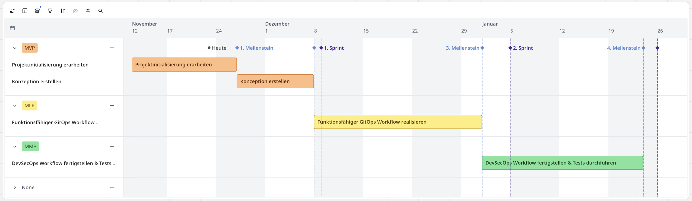
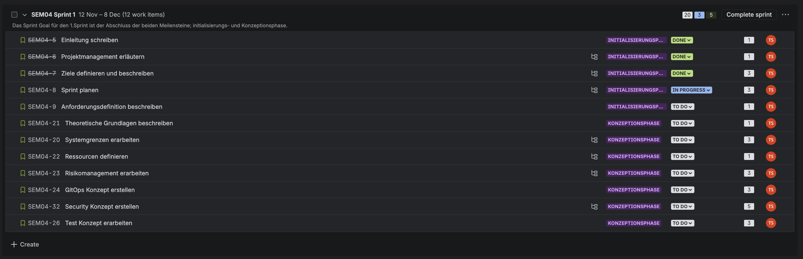
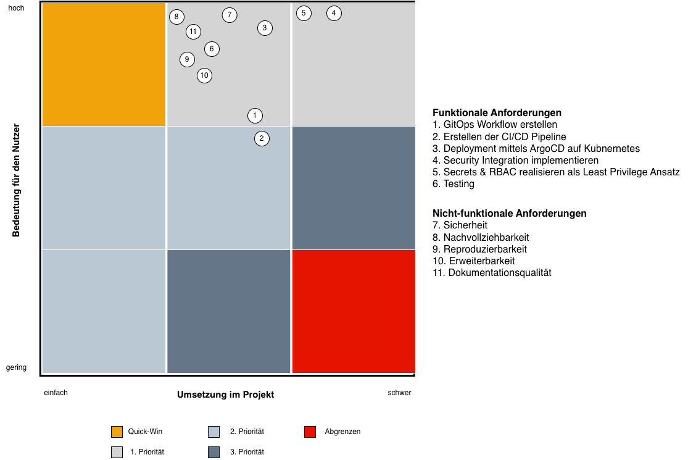
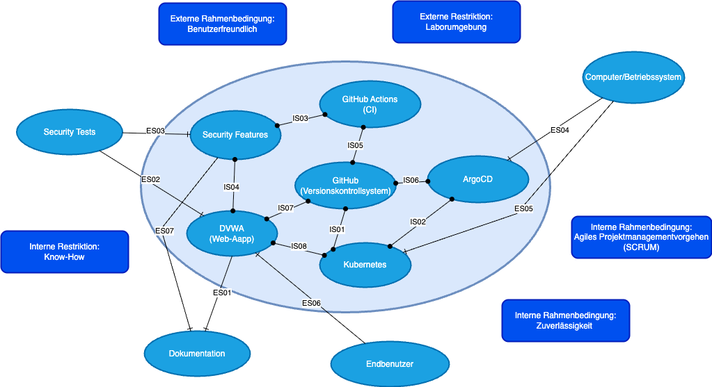
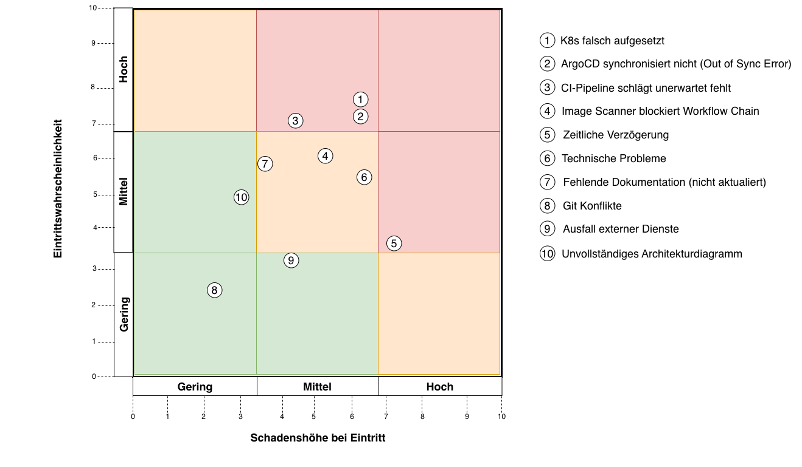
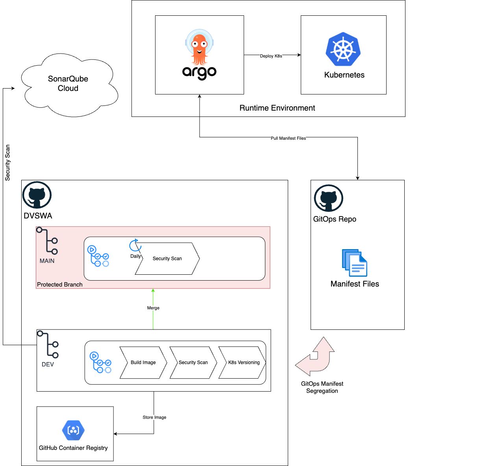

* [ ] Titelblatt
* [ ] Management Summary / Abstract

# Initialisierungsphase

## Einleitung

Im Rahmen meiner 4. Semesterarbeit an der Technischen Berufsschule Zürich soll ein GitOps Workflow auf Kubnernetes realisiert werden. Die Arbeit legt dabei besonderen Wert auf den Sicherheitsaspekt verfolgt dem Prinzip von DevSecOps. Als Proof of Concept, später auch PoC gennant, soll die zentrale Frage: _Wie kann mithilfe von GitOps (ArgoCD) und integrierten Sicherheitsprüfungen, wie Trivy ein sicherer, reproduzierbarer und automatisierter Deployment-Prozess für containerisierte Webapplikationen in Kubernetes realisiert werden? beantwortet werden._ beantwortet werden.

### Ausgangslage & Motivation

In der modernen Softwareentwicklung steigen die Anforderungen an Automatisierung, Sicherheit und Nachvollziehbarkeit entlang des gesamten Softwarebereitstellungsprozesses. Traditionelle CI/CD-Prozesse bieten zwar bereits eine gewisse Automatisierung, jedoch fehlt häufig eine integrierte Sicherheitsüberprüfung und eine vollständige Rückverfolgbarkeit von Änderungen bis in die Produktionsumgebung.
Insbesondere bei containerisierten Anwendungen in Kubernetes-Clustern besteht das Risiko, dass unsichere oder veraltete Container-Images im Betrieb genutzt.
Herkömmliche Deployments erfordern oftmals manuelle Eingriffe durch Entwickler oder Administratoren, was Fehleranfälligkeit begünstigen.

Die fiktive Firma Kubinet AG betreibt mehrere containerisierte Webapplikationen in einem Kubernetes-Cluster.
Der aktuelle Deployment-Prozess erfolgt manuell über ein klassisches CI/CD-System (Github Actions) ohne zentrale Sicherheitsprüfung oder automatische Validierung der Container-Images.
Dadurch besteht die Gefahr, dass fehlerhafte oder unsichere Images deployed werden, was sowohl Compliance-Vorgaben als auch Betriebssicherheit gefährdet. Da das Unternehmen nun an weitere Kunden gewinnt, steigen gleichzeitig die Sicherheitsmassnahmen an und Anforderungen. Ziel ist es einen Shift Left zu erzielen um den automatisierten Security Ansatz so früh wie möglichst einzubringen.

Das Unternehmen möchte den Bereitstellungsprozess modernisieren, indem ein GitOps-basierter Workflow eingeführt wird, welcher Sicherheitsüberprüfungen, wie Trivy integriert, Deployments automatisiert (ArgoCD) und sämtliche Änderungen nachvollziehbar im Git-Repo dokumentiert.

### Product Vision

Die Product Vision beschreibt kurz und klar, wofür ein Produkt existiert und welchen Nutzen es liefern soll. Im unteren Bild wurde ein Product Vision Board nach Roman Pichler erstellt, um das Produkt ganzheitlich zu verstehen und zu planen. Es ist deutlich detaillierter, konkreter und umfangreicher als die Vision selbst.


[Quelle](https://www.romanpichler.com/blog/the-product-vision-board/)

### Nicht Teil der Arbeit (Out of Scope)

Das Erarbeiten der webbasierten Flask Applikation ist nicht Teil dieser Arbeit und wird daher nicht im Detail erläutert. Bestandteile wie, ERM, Sequenzdiagramm oder UML fallen hier weg, da diese Bereiche, den Rahmen der Arbeit sprengen würden und nicht im Vordergrund stehen.

Als Webapplikation wird stattdessen auf eine vulnerable Webapplikation zurückgeriffen. Damit können die Security Askpekte in der Arbeit realisitisch geprüft und nachverfolgt werden. Damn Vulnerable Web Application kurz _DVWA_ ist ein Penetration Testing Projekt, das bewusst Schwachstellen in der Anwendung aufweisst und für Cyber Security Studenten eine Spielwiese fürs Hacken bietet. In meiner Arbeit soll die Security-Chain auf folgendes DVWA durchlaufen und dadurch aufzeigen, welche Gefahren zu erkennen sind.

## Projektmanagement

In der folgenden Semesterarbeit wird das Konzept der Agilen Projektmanagementmethode Scrum angewendet. Vorteil dieser Methode ist die flexible Anpassungsfähigkeit des Projekts, ohne dabei ein Risiko auf die Projektfortführung darzustellen. Durch kontinuierlichen Sprintzyklen kann die Arbeit fortgehend verbessert und weiterentwickelt werden. In den Reviews bzw. Closers Termine werden die erledigten und angehenden Aufgaben besprochen und ein konstruktives Feedback wird dabei von den jeweiligen Parteien gegeben.

## Projektorganisation

Das Scrum-Konzept verfolgt einen immer wiederkehrenden und inkrementellen Ansatz in der Projektentwicklung. In dieser Arbeit übernimmt der Projektabnehmer alle Scrum-Rollen selbst, was in der Regel nicht im eigentlichen Sinne des Konzepts vorgedacht ist. Nichtsdestotrotz kann es bei einer Einzelarbeit, wie dieser vorkommen, dass alle Rollen selbst vom Autor getragen werden. Die Organisation sieht wie folgt aus:

### SCRUM Master/Product Owner/Developer

```
Taher Al Saegh
Bertastrasse 2
8003 Zürich
Gitlab: taher.alsaegh
```

### Endbenutzer

```
Kubinet AG
Musterstrasse 10
3001 Bern
```

### Dozenten

```
Vor-/Nachname: Patrick Morgenegg
Funktion: Fachexperte DevOps
E-Mail: patrick.morgenegg@tbz.ch
Github: patrickmorgeneggtbz
```

```
Vor-/Nachname: Florian Huber
Funktion: Fachexperte Projektmanagement
E-Mail: florian.huber@tbz.ch
```

## Projektziele

Im folgenden Abschnitt werden die Ziele dieser Semesterarbeit definiert. Ausgangslange bildet die Analyse des aktuellen Zustands (IST-Zustand), aus dem anschliessend der gewünschte Soll-Zustand sowie die konkreten Projektziele abgeleitet werden.

### IST-Analyse

Aktuell werden containerisierte Applikationen häufig über klassische CI/CD-Pipelines bereitgestellt, die nur teilweise automatisiert sind und meist keine integrierten Sicherheitsmechanismen enthalten. Dadurch können fehlerhafte oder verwundbare Container-Images in produktionsnahe Umgebungen gelangen.
In vielen Umgebungen fehlt eine klare Trennung zwischen Build-, Security- und Deployment-Schritten, und Deployments erfolgen teilweise manuell oder ohne konsequente Nachvollziehbarkeit.

Die fiktive Firma Kubinet AG verwendet GitHub Actions als CI-Pipeline und führt Deployments in ein Kubernetes-Cluster aktuell ohne automatisierte Security-Gates und ohne GitOps-Prinzipien durch. Dadurch bestehen folgende Risiken:

- Unsichere oder veraltete Images können unbemerkt deployed werden.
- Manuelle Eingriffe führen zu Inkonsistenzen und Fehlern.
- Fehlende Transparenz erschwert Audits und Compliance.
- Keine vollständige Rückverfolgbarkeit von Änderungen.

### SOLL-Analyse (Systemziele)

Der Soll-Zustand beschreibt die gewünschte Zielarchitektur der Deployment-Pipeline und die Anforderungen an den zukünftigen Workflow:

- Deployments sollen vollständig automatisiert, reproduzierbar und versioniert sein.
- Sicherheitsprüfungen sollen fest in den Pipeline-Ablauf integriert sein.
- Der Deployment-Prozess soll nach GitOps-Prinzipien erfolgen d.h Änderungen werden ausschliesslich über Git gesteuert.
- Das System soll leicht erweiterbar und testbar sein, insbesondere für zukünftige Security-Integrationen.
- Der PoC soll demonstrieren, dass sichere, reproduzierbare und nachvollziehbare Deployments mittels GitOps und DevSecOps erfolgreich umsetzbar sind.

### SAMAT-Ziele

Ein SMART-Ziel ist eine Methode zur Zieldefinition, bei der ein Ziel anhand von fünf klaren Kriterien
formuliert wird. Jeder Buchstabe des Wortes SMART steht für eines dieser Kriterien und hilft dabei,
das Ziel konkret und überprüfbar zu beschreiben.

- **Spezifisch**: Aufbau eines GitOps-basierten Deployment-Workflows inkl. Sicherheitsprüfungen.
- **Messbar**: Deployment erfolgt über Kubernetes und die Sicherheitsanalyse ist durch das DVWA zu klar zu erkennen.
- **Akzeptiert**: Ziele entsprechen den Vorgaben der Semesterarbeit und sind realistisch umsetzbar.
- **Anspruchsvoll**: Integration mehrerer Tools (GitHub Actions, ArgoCD, Trivy, Kubernetes).
- **Terminiert**: Umsetzung der Arbeit erfolgt in 3 Sprints und ist am 27.01.2026 abzugeben.

## Abwicklungsziele

Die Abwicklungsziele beschreiben die wesentlichen Merkmale des Projektweges, die zur Erreichung
der Systemziele nötig sind. (B.Jenny, 2019, S. 132)

Das Projekt wird nach der agilen Projektmanagementmethode Scrum umgesetzt. Es ist in drei Sprints unterteilt, die jeweils konkrete User-Stories beinhalten. Nach jedem Sprint liegt ein Zwischenstand des Projektes vor. Der Fortschritt wird durch Sprint-Reviews überprüft und mit Sprint Retrospektiven reflektiert und verbessert. Anforderungen und Aufgaben können während der Entwicklung angepasst oder verfeinert werden. Die Umsetzung erfolgt in Zyklen, wodurch Risiken frühzeitig erkannt und der Projekterfolg schrittweise gesichert wird.

### Definition of Done (DoD)

Die Definition of Done (DoD) beschreibt eine klare Vereinbarung innerhalb des Teams, welche
Kriterien erfüllt sein müssen, damit das Product Backlog Item oder ein Sprint als fertig gilt. (Gärtner, 2020)

In den unten beschriebenen Punkten werden die nötigen Schritte definiert, welche dafür sorgen, dass
dieses Projekt als erledigt gilt. Neben den Akzeptanzkriterien, die jeweils in den User-Stories definiert
sind, gilt die DoD generell zur Erledigung des Projekts.

- **Inhaltliche Vollständigkeit**: Alle beschriebenen Anforderungen der Story oder Aufgabe wurden umgesetzt.
- **Dokumentation erstellt oder aktualisiert:**: Relevante Inhalte sind in der Semesterarbeit, im Architekturdiagramm oder in technischen Dokumenten nachvollziehbar dokumentiert.
- **Zeremonien eingehalten**: Alle in SCRUM beinhalteten Zeremonien sind eingeplant und werden durgefürht.
- **Qualitätsanforderungen eingehalten**: Verständliche Formulierung, korrekte Struktur und keine Rechtschreib- oder Grammatikfehler.
- **Testing durchgeführt**: Die Implemtierung ist erfolgreich getestet und läuft durch alle CI/CD Steps durch.

### Meilensteine

1. Meilenstein: Initialisierungsphase
   Ziel: Projektstart, Definition von Zielen, Rahmenbedingungen und Rollen
   Erledigt: XX
2. Meilenstein: Konzeptionsphase
   Ziel: Ausarbeitung der Systemarchitektur, Schnittstellen, Ressourcen- und Risikoplanung
   Erledigt: XX
3. Meilenstein: Realisierungsphase
   Ziel: Technsiche Umsetzung des GitOps-Workflows, Deployment auf K8s, Security Tests und Validation sicherstellen
   Erledigt: XX
4. Meilenstein: Einführungsphase
   Ziel: Fazit, Reflextion, Lessons Learned,
   Erledigt: XX

### Story Point Schätzung
https://clickup.com/de/blog/222797/punkte-der-fibonacci-geschichte

## Releases-Planning --> Zeitplan?

Beachte diesen Punkt mit dem GitOps Workflow Konzept. MVP zusammen mit Git Tags/Versionierung der Branches



### Minimum Viable Product (MVP)

### Minimum Marketable Product (MMP)

### Minimum Lovable Product (MLP)

### 1. Sprint vom 12.11 - 08.12.2025



| Story                               | Akzeptanzkriterium                 | Points |
| :---------------------------------- | :--------------------------------- | :----- |
| Einfürhung schreiben               | [SEM04-5](https://shorturl.at/voJ7B)  | 1      |
| Projektmanagement erläutern        | [SEM04-6](https://shorturl.at/nkYM0)  | 1      |
| Ziele definieren und beschreiben    | [SEM04-7](https://shorturl.at/MJHTs)  | 3      |
| Sprint planen                       | [SEM04-8](https://shorturl.at/CMeLD)  | 3      |
| Anforderungsdefinition beschreiben  | [SEM04-9](https://shorturl.at/fGoiQ)  | 1      |
| Theoretische Grundlagen beschreiben | [SEM04-21](https://shorturl.at/SZBGA) | 1      |
| Systemgrenzen erarbeiten            | [SEM04-20](https://shorturl.at/8NmMf) | 3      |
| Ressourcen definieren               | [SEM04-22](https://shorturl.at/5Ye3s) | 1      |
| Risikomanagement erarbeiten         | [SEM04-23](https://rb.gy/humncv)      | 3      |
| GitOps Konzept erstellen            | [SEM04-24](https://h7.cl/1kg3v)       | 3      |
| Security Konzept erstellen          | [SEM04-32](https://h7.cl/1fpry)       | 5      |
| Test Konzept erarbeiten             | [SEM04-26](https://h7.cl/1kg3M)       | 3      |

> [!NOTE]
> **Sprint Goal**: Abschluss und Erreichung der beiden Meilensteine; Initialisierungs- und Konzeptionsphase.

### 2. Sprint vom xx.xx - xx.xx.2025

Als Table mit den Stories/Tasks und Akzepttanzkriterien

### 3. Sprint vom xx.xx - xx.xx.2025

Als Table mit den Stories/Tasks und Akzepttanzkriterien

## Anforderungsdefinition

Eine Anforderung beschreibt die Eigenschaften oder Leistungen, welches von einem Produkt erwartet wird, um den End-Benutzer zufrieden zu stellen. (Rohde & Pfetzing, 2020, S. 171)

In der unteren Grafik ist ein Anforderungsportfolio zu erkennen, welches die Prioritäten aller Anforderungen visuell veranschaulicht. Die Anforderungen werden als funktional und nicht-funktional unterschieden. Funktionale Anforderungen beschreiben die konkreten Anforderungen ans System, wie beispeilsweise Kernfunktionen des Produkts. Nicht funktionale Anforderungen beschreiben sogenante Qualitätsmerkmale, wie gut oder uneter welchen Bedingungen das System funktionert. Jede Anforderung ist mit einer Nummer vermerkt und ist der Priorisierung im Gitter entsprechend zugeordnet.

Die Grafik teilt uns mit, dass die Anforderungen für den Kunden eine grosse Beduetung für den Nutzen beiträgt und das Projekt mittelschwer umsetzbar ist. Somit veranschaulicht uns die Grafik den Nutzen und Ertrag des gesamten Projekts und eine Einschätzung der Machbarkeit, die während der Arbeit durch Prioritäten unterschieden wird.



### Funktionale Anforderung

Hier ist die Auflistung aller funktionalen Anforderungen:

- GitOps Workflow erstellen
- Erstellen der CI/CD Pipeline
- Deployment mittels ArgoCD auf Kubnernetes
- Security Integration implementieren
- Secrets & RBAC realisieren als Least Privilege Ansatz
- Testing

### Nicht-funktionale Anforderungen

Hier ist die Auflistung aller nicht-funktionalen Anforderungen:

- Sicherheit
- Nachvollziehbarkeit
- Reproduzierbarkeit
- Erweiterbarkeit
- Dokumentationsqualität

# Konzeptionsphase

## Theoretische Grundlagen

Im folgenden Abschnitt werden die wichtigsten Begriffe kurz und präzise erläutert, um ein einheitliches Verständnis der verwendeten Konzepte sicherzustellen.

### CI/CD

Ziel von CI/CD, kurz für Continuous Integration und Continuous Delivery/Deployment, ist die Optimierung und Beschleunigung des Softwareentwicklungs-Lifecycles.

Continuous Integration (CI) bezieht sich auf die Praktik, Codeänderungen automatisch und regelmässig in ein gemeinsames Quellcode-Repository zu integrieren. Continuous Delivery und/oder Continuous Deployment (CD) ist ein zweiteiliger Prozess, der die Integration, das Testen und die Bereitstellung der Codeänderungen umfasst. Continuous Delivery beinhaltet kein automatisches Produktiv-Deployment, während beim Continuous Deployment Update-Releases automatisch in die Produktivumgebung übergeben werden. [Quelle](https://www.redhat.com/de/topics/devops/what-is-ci-cd)

### Kubnernetes

Das Ziel von Kubernetes, kurz K8s ist die Automatisierung und Vereinfachung der Bereitstellung, Skalierung und Verwaltung von containerisierten Anwendungen über mehrere Computer hinweg.

Kubernetes ist eine portable, erweiterbare Open-Source-Plattform zur Verwaltung von containerisierten Arbeitslasten und Services, die sowohl die deklarative Konfiguration als auch die Automatisierung erleichtert. [Quelle](https://kubernetes.io/de/docs/concepts/overview/what-is-kubernetes/)

### ArgoCD

Argo CD ist ein deklaratives CD-Tool (Continuous Delivery) für Kubernetes. Sie können es als eigenständiges Tool oder als Teil Ihres CI/CD-Workflows einsetzen, um Ihren Clustern die erforderlichen Ressourcen bereitzustellen.

Damit das Management Ihrer Infrastruktur- und Anwendungskonfigurationen auf GitOps abgestimmt werden kann, muss Ihr Git Repository die Single Source of Truth sein. Der gewünschte Zustand Ihres Systems sollte ein versionierter, deklarativ definierter Zustand sein, der automatisch abgerufen wird. Hier kommt Argo CD ins Spiel. [Quelle](https://www.redhat.com/de/topics/devops/what-is-argocd)

### DevSecOps

DevSecOps steht für „Development, Security and Operations“. Es ist ein Ansatz für Unternehmenskultur, Automatisierung und Plattformdesign, bei dem die Sicherheit als eine gemeinsame Verantwortung im gesamten IT-Lifecycle integriert ist.

Bei DevSecOps geht es nicht nur um die Entwicklungs- und Operations-Teams. Wenn Sie die Agilität und Reaktionsfähigkeit von DevOps vollständig ausschöpfen möchten, muss auch die IT-Sicherheit im gesamten Lifecycle Ihrer Apps integriert sein. [Quelle](http://redhat.com/de/topics/devops/what-is-devsecops)

### GtiHub Actions

GitHub Actions ist eine Plattform für Continuous Integration und Continuous Delivery (CI/CD), mit der du deine Build-, Test- und Bereitstellungspipeline automatisieren kannst. Du kannst Workflows erstellen, mit denen du alle Pull Requests für dein Repository erstellen und testen sowie gemergte Pull Requests für die Produktion bereitstellen kannst. [Quelle](http://docs.github.com/de/actions/get-started/understand-github-actions)

## Systemgrenzen

### SEUSAG

Ein System ist im organisatorischen Sinn eine gegenüber der Umwelt abgegrenzte Gesamtheit von Elementen (in einer Unternehmung z.B. die Elemente Einkauf, Entwicklung, Verwaltung, Verkauf) zwischen denen Beziehungen bestehen. (B.Jenny, 2019, S. 77)



#### Interne-Schnittstellen

| IS  | Definition                                                                                                                          |
| :-- | :---------------------------------------------------------------------------------------------------------------------------------- |
| IS1 | Die Kubnerentes Manifest Files sind auf Github abgelegt. Damit ist sichergestellt das der Code einheitlich und zentral abgelegt ist |
| IS2 | Der Kubnernetes Cluster wird über Argo CD deployed                                                                                 |
| IS3 | Das Docker Image wird in der CI Pipeline auf Schwachstellen und Sicherheitslücken geprüft                                         |
| IS4 | Die Security Features werden auf die Web-Applikation angewendet und prüft die App auf Herz und Nieren                              |
| IS5 | Der GitHub Workflow ist in GitHub zentral abgelegt und steuert die Ausführung der CI Pipeline                                      |
| IS6 | Argo CD ist mit dem GitHub Repo verlinkt. Nur so kann ein sauberer GitOps Prozess funktionieren                                     |
| IS7 | Der Quellcode der Web-Applikation ist im GitHub Repo abgelegt                                                                       |
| IS8 | Die Applikation läuft schlussendlich auf einem Kubnernets Cluster                                                                  |

#### Externe-Schnittstellen

| ES  | Definition                                                                                                                      |
| :-- | :------------------------------------------------------------------------------------------------------------------------------ |
| ES1 | Die aus dem Internet bezogene Applikation bietet eine Dokumentation an, welche für die hier verwendete Weiterarbeit nötig ist |
| ES2 | Alle Security Tests von Drittanbietern werden auf die Webapplikaton angewendet                                                  |
| ES3 | Die Security Tests beinhalten die bereits implemtierten Security Features, welche zuvor in der CI Pipeline definiert sind       |
| ES4 | Argo CD läuft lokal auf dem Computer                                                                                           |
| ES5 | Kubernetes wird lokal mittels minikube ausgerollt                                                                               |
| ES6 | Der Endbenutzer kann die Applikation nutzen und erkennt dabei die Schwachstellen                                                |
| ES7 | Die Securtiy Features werden vollständig dokumentiert                                                                          |

## Ressourcen

«Ressourcen sind nach DIN69902 Personal und Sachmittel, die zur von Vorgängen, Arbeitspaketen und Projekten benötigt werden. Sie können wiederholt oder nur einmal einsetzbar sein. Sie können in wert- oder Mengeneinheiten beschrieben und für einen Zeitpunkt oder Zeitraum disponiert werden.»
(Rohde & Pfetzing, 2020, S.219)

### Ressourcenplanung

Die Ressourcenplanung wird in nicht-verzehrbare und verzehrbare Einsatzmittel unterschieden. Die nicht-verzehrbare Mittel sind Personal und Sachmittel, welche nicht verbraucht werden, sondern eher in Leistungen und Dauer abgerechnet und eingeplant werden.

Die verzehrbaren Einsatzmittel sind hingegen alle Materialien und auch Geldmittel, die während dem Projekt verbraucht werden. Bei diesen Mittel sind neben der Bereitstellung auch wichtig zu planen, wann und wie diese neu beschlaft werden können.

### Nicht-verzehrbare Mittel

- SCRUM Master
- Product Owner
- Developer
- Kubernetes (minikube)
- ArgoCD
- Computer
- GitHub
- SonarQube
- Trivy
- Snyk

### Verzehrbare Mittel

- Storage
- GitHub Runner
- Strom
- Lizenzen
- Zeit

## Risikomanagement

Risikomanagement beschreibt die systematische Identifikation, Analyse, Bewertung und Überwachung von Risiken in Projekten oder Organisationen. Ziel ist es, die negativen Folgen in einem Projekt zu minimieren oder gar zu beseitigen. (ChatGPT, persönliche Kommunikation, 16. Dez. 2024)

### Risikoregister

| Nr. | Risiko                                           | Hauptursache                                                             | Erste Massnahme                              | Eintritt | Auswirkungen | Risikostufe |
| :-- | ------------------------------------------------ | ------------------------------------------------------------------------ | -------------------------------------------- | -------- | ------------ | ----------- |
| 1   | K8s falsch aufgesetzt                            | Deployments, RBAC, Secrets sind falsch konfiguriert                      | mit kubectl cmd troubleshooten               | Mittel   | Hoch         | Hoch        |
| 2   | ArgoCD synchronisiert nicht (Out-of-Sync Fehler) | Fehlende Manifeste oder Berechtigung                                     | ArgoCD Logs prüfen                          | Hoch     | Hoch         | Hoch        |
| 3   | CI-Pipeline schlägt unerwartet fehl             | Syntaxfehler, falsche Tags, Build-Fehler oder fehlende Secretes          | Pipeline schrittweise testen                 | Hoch     | Mittel       | Hoch        |
| 4   | Image Scanner blockiert Workflow Chain           | DVWA deployment wird blockiert, weil es voll mit Schwachstellen ist      | Schwellwerte richtig setzen                  | Hoch     | Niedrig      | Mittel      |
| 5   | Zeitliche Verzögerungen                         | Implementierung & Planung dauert länger als geplant                     | Backlog reduzieren                           | Mittel   | Hoch         | Hoch        |
| 6   | Technische Probleme                              | Unerwartete Probleme tauchen auf                                         | Ressourcen überprüfen & minikube reseten   | Hoch     | Mittel       | Hoch        |
| 7   | Fehlende Dokumentation (nicht aktualisiert)      | Zu starker Fokus auf Realisierung als Dokumentation                      | Dokumentation als DoD überprüfen           | Mittel   | Mitel        | Mittel      |
| 8   | Git Konfilikte                                   | Mehrere Developer arbeiten am gleichen Codeabschnitt                     | Häufig Mergen und kleine Branchen erstellen | Niedrig  | Mittel       | Mittel      |
| 9   | Ausfall externer Dienste                         | GitHub ist nicht erreichbar                                              | Lokale Tests fortsetzen oder Doku verbessern | Niedirg  | Hoch         | Hoch        |
| 10  | Unvollständiges Architekturdiagramm             | Zu ungenaue Vorbereitung des Architekur und fehlendes Check mit Dozenten | Architekturdiagramm überarbeiten            | Mittel   | Hoch         | Hoch        |

### Risikoportfolio

Das Risikoportfolio veranschaulicht die Einflussgrössen der Risiken auf das gesamte Projekt hinweg. Sinn und Zweck ist es dabei eine Einschätzung, der Risikoherde bildlich darzustellen und die Abschätzung zwischen der Eintrittswahrscheinlichkeit und der Schadenshöhe beim Eintreffen des Risikos vorherzusehen.
Aus dem Portfolio ist zu erkennen, dass die Risiken im Projekt mittel bis hoch eingeschätzt werden. Die vielen technischen Komponenten bilden eine grosse Abhängigkeit in Bezug der Umsetzung und Machbarkeit des Projkets.

Des Weiteren zeigt das Portfolio, dass insbesondere technische Fehlkonfigurationen und Zeitverzug das grösste Risiko für den Projekterfolg darstellen. Diese Risiken müssen daher frühzeitig adressiert werden, um den erfolgreichen Abschluss des Proof of Concepts sicherzustellen.
`<br>`



#### Resultierende Nacharbeiten

- Dokumentation zum Einrichten und Aufsetzen des K8s Clusters: [Link](https://kubernetes.io/docs/concepts/overview/)
- Lernvideos zu K8s von KodeKloud: [Link](https://shorturl.at/RRXJS)
- Weitere Recherchen zu ArgoCD tätigen: [Link](https://argo-cd.readthedocs.io/en/stable/)
- Weniger Stories im nächsten Sprint assignen.

## Architekturdiagramm

In meinem Architekturdiagramm wird dargestellt, wie der Security-GitOps-Workflow funktioniert und welche Komponenten daran beteiligt sind.
Im Mittelpunkt stehen zwei Repositories, die den zentralen Ablauf steuern: Das Applikation-Repository für den Build-Stage und die Security-Prüfungen sowie das GitOps-Repository als „Single Source of Truth“ für den gewünschten Deployment-Zustand.
Über GitHub Actions werden Build und Security-Checks ausgeführt und anschliessend die Kubernetes-Manifeste im GitOps-Repository aktualisiert. ArgoCD überwacht das GitOps-Repository und synchronisiert Änderungen automatisiert in den Kubernetes-Cluster, wodurch die neue Version der Applikation ausgerollt wird.

Der Best-Practice-Ansatz mit zwei separaten Repositories entspricht dem Prinzip der GitOps Manifest Segregation und bietet durch die konsequente Isolation des Deployment-Prozesses einen zusätzlichen Schutz.
Durch diese Trennung kann das Deployment unabhängig vom aktuellen Zustand der Codebasis kontrolliert und nachvollziehbar gesteuert werden. Änderungen am Applikationscode führen somit nicht automatisch zu einem Deployment, sondern erst dann, wenn die Kubernetes-Manifeste im GitOps-Repository bewusst aktualisiert werden. Dadurch wird verhindert, dass jede kleinere Codeänderung unmittelbar einen Deployment-Prozess auslöst und es entsteht ein kontrollierter, stabiler und sicherer Bereitstellungsablauf.



## Security Konzept

### Evaluation von Trivy etc.

## Test Konzept

# Realisierungsphase

## GitHub-Repository & Branching

## FlaskApp & Tests

## App in Docker

## CI/CD Pipeline

## Kubernetes minikube & ArgoCD implementation

## Security implementation

- Trivy implementieren
- Secret Management
- RBAC / Least Privilege

## Post Deploy Smoke Tests

# Einführungsphase

## Fazit

### Evaluation / Zielerreichung

## Reflexion

### Lesson Learned

## Aussicht

# Literaturverzeichnis

# Anhang
