* [ ] Titelblatt
* [ ] Management Summary / Abstract

# Initialisierungsphase

## Einleitung

Im Rahmen meiner 4. Semesterarbeit an der Technischen Berufsschule Zürich soll ein GitOps Workflow auf Kubnernetes realisiert werden. Die Arbeit legt dabei besonderen Wert auf den Sicherheitsaspekt verfolgt dem Prinzip von DevSecOps. Als Proof of Concept, später auch PoC gennant, soll die zentrale Frage: _Wie kann mithilfe von GitOps (ArgoCD) und integrierten Sicherheitsprüfungen, wie Trivy ein sicherer, reproduzierbarer und automatisierter Deployment-Prozess für containerisierte Webapplikationen in Kubernetes realisiert werden? beantwortet werden._ beantwortet werden.

### Ausgangslage & Motivation

In der modernen Softwareentwicklung steigen die Anforderungen an Automatisierung, Sicherheit und Nachvollziehbarkeit entlang des gesamten Softwarebereitstellungsprozesses. Traditionelle CI/CD-Prozesse bieten zwar bereits eine gewisse Automatisierung, jedoch fehlt häufig eine integrierte Sicherheitsüberprüfung und eine vollständige Rückverfolgbarkeit von Änderungen bis in die Produktionsumgebung.
Insbesondere bei containerisierten Anwendungen in Kubernetes-Clustern besteht das Risiko, dass unsichere oder veraltete Container-Images im Betrieb genutzt.
Herkömmliche Deployments erfordern oftmals manuelle Eingriffe durch Entwickler oder Administratoren, was Fehleranfälligkeit begünstigen.

Die fiktive Firma Kubinet AG betreibt mehrere containerisierte Webapplikationen in einem Kubernetes-Cluster.
Der aktuelle Deployment-Prozess erfolgt manuell über ein klassisches CI/CD-System (Github Actions) ohne zentrale Sicherheitsprüfung oder automatische Validierung der Container-Images.
Dadurch besteht die Gefahr, dass fehlerhafte oder unsichere Images deployed werden, was sowohl Compliance-Vorgaben als auch Betriebssicherheit gefährdet. Da das Unternehmen nun an weitere Kunden gewinnt, steigen gleichzeitig die Sicherheitsmassnahmen an und Anforderungen. Ziel ist es einen Shift Left zu erzielen um den automatisierten Security Ansatz so früh wie möglichst einzubringen.

Das Unternehmen möchte den Bereitstellungsprozess modernisieren, indem ein GitOps-basierter Workflow eingeführt wird, welcher Sicherheitsüberprüfungen, wie Trivy integriert, Deployments automatisiert (ArgoCD) und sämtliche Änderungen nachvollziehbar im Git-Repo dokumentiert.

### Product Vision

Die Product Vision beschreibt kurz und klar, wofür ein Produkt existiert und welchen Nutzen es liefern soll. Im unteren Bild wurde ein Product Vision Board nach Roman Pichler erstellt, um das Produkt ganzheitlich zu verstehen und zu planen. Es ist deutlich detaillierter, konkreter und umfangreicher als die Vision selbst.

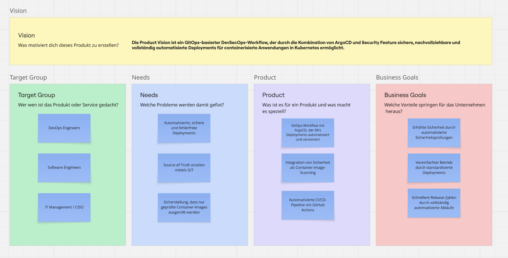
[Quelle](https://www.romanpichler.com/blog/the-product-vision-board/)

### Nicht Teil der Arbeit (Out of Scope)

Das Erarbeiten der webbasierten Flask Applikation ist nicht Teil dieser Arbeit und wird daher nicht im Detail erläutert. Bestandteile wie, ERM, Sequenzdiagramm oder UML fallen hier weg, da diese Bereiche, den Rahmen der Arbeit sprengen würden und nicht im Vordergrund stehen.

Als Webapplikation wird stattdessen auf eine vulnerable Webapplikation zurückgeriffen. Damit können die Security Askpekte in der Arbeit realisitisch geprüft und nachverfolgt werden. Damn Vulnerable Web Application kurz _DVWA_ ist ein Penetration Testing Projekt, das bewusst Schwachstellen in der Anwendung aufweisst und für Cyber Security Studenten eine Spielwiese fürs Hacken bietet. In meiner Arbeit soll die Security-Chain auf folgendes DVWA durchlaufen und dadurch aufzeigen, welche Gefahren zu erkennen sind.

## Projektmanagement

In der folgenden Semesterarbeit wird das Konzept der Agilen Projektmanagementmethode Scrum angewendet. Vorteil dieser Methode ist die flexible Anpassungsfähigkeit des Projekts, ohne dabei ein Risiko auf die Projektfortführung darzustellen. Durch kontinuierlichen Sprintzyklen kann die Arbeit fortgehend verbessert und weiterentwickelt werden. In den Reviews bzw. Closers Termine werden die erledigten und angehenden Aufgaben besprochen und ein konstruktives Feedback wird dabei von den jeweiligen Parteien gegeben.

## Projektorganisation

Das Scrum-Konzept verfolgt einen immer wiederkehrenden und inkrementellen Ansatz in der Projektentwicklung. In dieser Arbeit übernimmt der Projektabnehmer alle Scrum-Rollen selbst, was in der Regel nicht im eigentlichen Sinne des Konzepts vorgedacht ist. Nichtsdestotrotz kann es bei einer Einzelarbeit, wie dieser vorkommen, dass alle Rollen selbst vom Autor getragen werden. Die Organisation sieht wie folgt aus:

### SCRUM Master/Product Owner/Developer

```
Taher Al Saegh
Bertastrasse 2
8003 Zürich
Gitlab: taher.alsaegh
```

### Endbenutzer

```
Kubinet AG
Musterstrasse 10
3001 Bern
```

### Dozenten

```
Vor-/Nachname: Patrick Morgenegg
Funktion: Fachexperte DevOps
E-Mail: patrick.morgenegg@tbz.ch
Github: patrickmorgeneggtbz
```

```
Vor-/Nachname: Florian Huber
Funktion: Fachexperte Projektmanagement
E-Mail: florian.huber@tbz.ch
```

## Projektziele

Im folgenden Abschnitt werden die Ziele dieser Semesterarbeit definiert. Ausgangslange bildet die Analyse des aktuellen Zustands (IST-Zustand), aus dem anschliessend der gewünschte Soll-Zustand sowie die konkreten Projektziele abgeleitet werden.

### IST-Analyse

Aktuell werden containerisierte Applikationen häufig über klassische CI/CD-Pipelines bereitgestellt, die nur teilweise automatisiert sind und meist keine integrierten Sicherheitsmechanismen enthalten. Dadurch können fehlerhafte oder verwundbare Container-Images in produktionsnahe Umgebungen gelangen.
In vielen Umgebungen fehlt eine klare Trennung zwischen Build-, Security- und Deployment-Schritten, und Deployments erfolgen teilweise manuell oder ohne konsequente Nachvollziehbarkeit.

Die fiktive Firma Kubinet AG verwendet GitHub Actions als CI-Pipeline und führt Deployments in ein Kubernetes-Cluster aktuell ohne automatisierte Security-Gates und ohne GitOps-Prinzipien durch. Dadurch bestehen folgende Risiken:

- Unsichere oder veraltete Images können unbemerkt deployed werden.
- Manuelle Eingriffe führen zu Inkonsistenzen und Fehlern.
- Fehlende Transparenz erschwert Audits und Compliance.
- Keine vollständige Rückverfolgbarkeit von Änderungen.

### SOLL-Analyse (Systemziele)

Der Soll-Zustand beschreibt die gewünschte Zielarchitektur der Deployment-Pipeline und die Anforderungen an den zukünftigen Workflow:

- Deployments sollen vollständig automatisiert, reproduzierbar und versioniert sein.
- Sicherheitsprüfungen sollen fest in den Pipeline-Ablauf integriert sein.
- Der Deployment-Prozess soll nach GitOps-Prinzipien erfolgen d.h Änderungen werden ausschliesslich über Git gesteuert.
- Das System soll leicht erweiterbar und testbar sein, insbesondere für zukünftige Security-Integrationen.
- Der PoC soll demonstrieren, dass sichere, reproduzierbare und nachvollziehbare Deployments mittels GitOps und DevSecOps erfolgreich umsetzbar sind.

### SAMAT-Ziele

Ein SMART-Ziel ist eine Methode zur Zieldefinition, bei der ein Ziel anhand von fünf klaren Kriterien
formuliert wird. Jeder Buchstabe des Wortes SMART steht für eines dieser Kriterien und hilft dabei,
das Ziel konkret und überprüfbar zu beschreiben.

- **Spezifisch**: Aufbau eines GitOps-basierten Deployment-Workflows inkl. Sicherheitsprüfungen.
- **Messbar**: Deployment erfolgt über Kubernetes und die Sicherheitsanalyse ist durch das DVWA zu klar zu erkennen.
- **Akzeptiert**: Ziele entsprechen den Vorgaben der Semesterarbeit und sind realistisch umsetzbar.
- **Anspruchsvoll**: Integration mehrerer Tools (GitHub Actions, ArgoCD, Trivy, Kubernetes).
- **Terminiert**: Umsetzung der Arbeit erfolgt in 3 Sprints und ist am 27.01.2026 abzugeben.

## Abwicklungsziele

Die Abwicklungsziele beschreiben die wesentlichen Merkmale des Projektweges, die zur Erreichung
der Systemziele nötig sind. (B.Jenny, 2019, S. 132)

Das Projekt wird nach der agilen Projektmanagementmethode Scrum umgesetzt. Es ist in drei Sprints unterteilt, die jeweils konkrete User-Stories beinhalten. Nach jedem Sprint liegt ein Zwischenstand des Projektes vor. Der Fortschritt wird durch Sprint-Reviews überprüft und mit Sprint Retrospektiven reflektiert und verbessert. Anforderungen und Aufgaben können während der Entwicklung angepasst oder verfeinert werden. Die Umsetzung erfolgt in Zyklen, wodurch Risiken frühzeitig erkannt und der Projekterfolg schrittweise gesichert wird.

### Definition of Done (DoD)

Die Definition of Done (DoD) beschreibt eine klare Vereinbarung innerhalb des Teams, welche
Kriterien erfüllt sein müssen, damit das Product Backlog Item oder ein Sprint als fertig gilt. (Gärtner, 2020)

In den unten beschriebenen Punkten werden die nötigen Schritte definiert, welche dafür sorgen, dass
dieses Projekt als erledigt gilt. Neben den Akzeptanzkriterien, die jeweils in den User-Stories definiert
sind, gilt die DoD generell zur Erledigung des Projekts.

- **Inhaltliche Vollständigkeit**: Alle beschriebenen Anforderungen der Story oder Aufgabe wurden umgesetzt.
- **Dokumentation erstellt oder aktualisiert:**: Relevante Inhalte sind in der Semesterarbeit, im Architekturdiagramm oder in technischen Dokumenten nachvollziehbar dokumentiert.
- **Zeremonien eingehalten**: Alle in SCRUM beinhalteten Zeremonien sind eingeplant und werden durgefürht.
- **Qualitätsanforderungen eingehalten**: Verständliche Formulierung, korrekte Struktur und keine Rechtschreib- oder Grammatikfehler.
- **Testing durchgeführt**: Die Implemtierung ist erfolgreich getestet und läuft durch alle CI/CD Steps durch.

### Meilensteine

1. Meilenstein: Initialisierungsphase
   Ziel: Projektstart, Definition von Zielen, Rahmenbedingungen und Rollen
   Erledigt: XX
2. Meilenstein: Konzeptionsphase
   Ziel: Ausarbeitung der Systemarchitektur, Schnittstellen, Ressourcen- und Risikoplanung
   Erledigt: XX
3. Meilenstein: Realisierungsphase
   Ziel: Technsiche Umsetzung des GitOps-Workflows, Deployment auf K8s, Security Tests und Validation sicherstellen
   Erledigt: XX
4. Meilenstein: Einführungsphase
   Ziel: Fazit, Reflextion, Lessons Learned,
   Erledigt: XX

### Story Point Schätzung
https://clickup.com/de/blog/222797/punkte-der-fibonacci-geschichte

## Releases-Planning --> Zeitplan?

Beachte diesen Punkt mit dem GitOps Workflow Konzept. MVP zusammen mit Git Tags/Versionierung der Branches

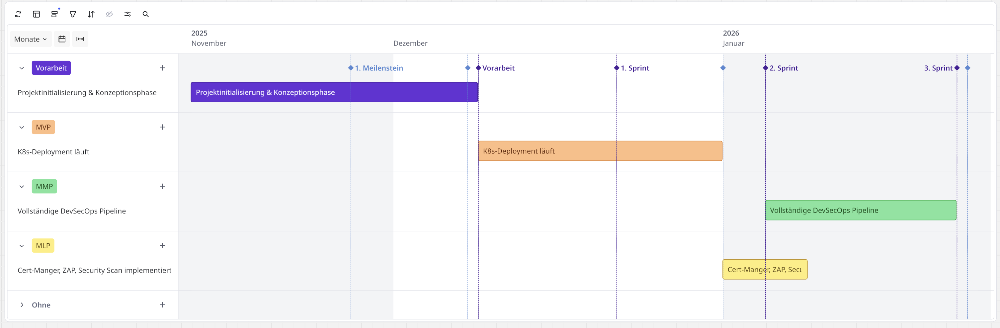

### Minimum Viable Product (MVP)

### Minimum Marketable Product (MMP)

### Minimum Lovable Product (MLP)

### 1. Sprint vom 12.11 - 08.12.2025

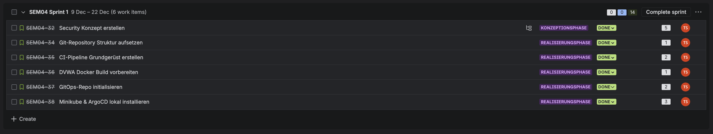

| Story                               | Akzeptanzkriterium                 | Points |
| :---------------------------------- | :--------------------------------- | :----- |
| Einfürhung schreiben               | [SEM04-5](https://shorturl.at/voJ7B)  | 1      |
| Projektmanagement erläutern        | [SEM04-6](https://shorturl.at/nkYM0)  | 1      |
| Ziele definieren und beschreiben    | [SEM04-7](https://shorturl.at/MJHTs)  | 3      |
| Sprint planen                       | [SEM04-8](https://shorturl.at/CMeLD)  | 3      |
| Anforderungsdefinition beschreiben  | [SEM04-9](https://shorturl.at/fGoiQ)  | 1      |
| Theoretische Grundlagen beschreiben | [SEM04-21](https://shorturl.at/SZBGA) | 1      |
| Systemgrenzen erarbeiten            | [SEM04-20](https://shorturl.at/8NmMf) | 3      |
| Ressourcen definieren               | [SEM04-22](https://shorturl.at/5Ye3s) | 1      |
| Risikomanagement erarbeiten         | [SEM04-23](https://rb.gy/humncv)      | 3      |
| GitOps Konzept erstellen            | [SEM04-24](https://h7.cl/1kg3v)       | 3      |
| Security Konzept erstellen          | [SEM04-32](https://h7.cl/1fpry)       | 5      |
| Test Konzept erarbeiten             | [SEM04-26](https://h7.cl/1kg3M)       | 3      |

> [!NOTE]
> **Sprint Goal**: Abschluss und Erreichung der beiden Meilensteine; Initialisierungs- und Konzeptionsphase.

### 2. Sprint vom xx.xx - xx.xx.2025

Als Table mit den Stories/Tasks und Akzepttanzkriterien

### 3. Sprint vom xx.xx - xx.xx.2025

Als Table mit den Stories/Tasks und Akzepttanzkriterien

## Anforderungsdefinition

Eine Anforderung beschreibt die Eigenschaften oder Leistungen, welches von einem Produkt erwartet wird, um den End-Benutzer zufrieden zu stellen. (Rohde & Pfetzing, 2020, S. 171)

In der unteren Grafik ist ein Anforderungsportfolio zu erkennen, welches die Prioritäten aller Anforderungen visuell veranschaulicht. Die Anforderungen werden als funktional und nicht-funktional unterschieden. Funktionale Anforderungen beschreiben die konkreten Anforderungen ans System, wie beispeilsweise Kernfunktionen des Produkts. Nicht funktionale Anforderungen beschreiben sogenante Qualitätsmerkmale, wie gut oder uneter welchen Bedingungen das System funktionert. Jede Anforderung ist mit einer Nummer vermerkt und ist der Priorisierung im Gitter entsprechend zugeordnet.

Die Grafik teilt uns mit, dass die Anforderungen für den Kunden eine grosse Beduetung für den Nutzen beiträgt und das Projekt mittelschwer umsetzbar ist. Somit veranschaulicht uns die Grafik den Nutzen und Ertrag des gesamten Projekts und eine Einschätzung der Machbarkeit, die während der Arbeit durch Prioritäten unterschieden wird.

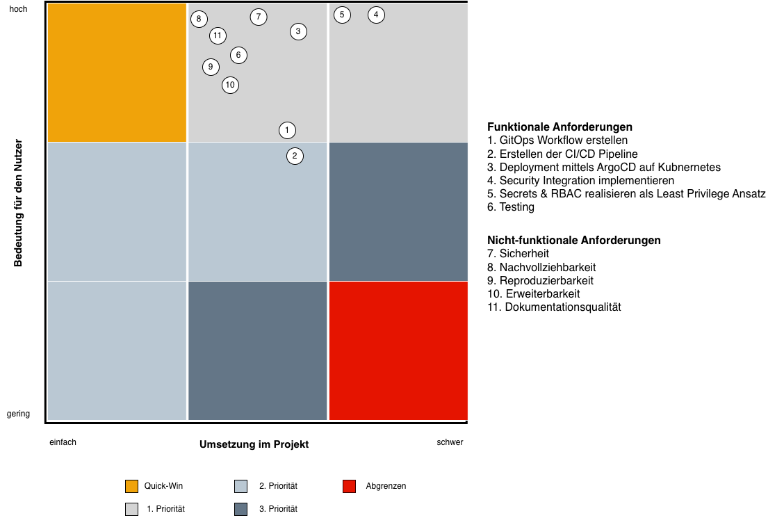

### Funktionale Anforderung

Hier ist die Auflistung aller funktionalen Anforderungen:

- GitOps Workflow erstellen
- Erstellen der CI/CD Pipeline
- Deployment mittels ArgoCD auf Kubnernetes
- Security Integration implementieren
- Secrets & RBAC realisieren als Least Privilege Ansatz
- Testing

### Nicht-funktionale Anforderungen

Hier ist die Auflistung aller nicht-funktionalen Anforderungen:

- Sicherheit
- Nachvollziehbarkeit
- Reproduzierbarkeit
- Erweiterbarkeit
- Dokumentationsqualität

# Konzeptionsphase

## Theoretische Grundlagen

Im folgenden Abschnitt werden die wichtigsten Begriffe kurz und präzise erläutert, um ein einheitliches Verständnis der verwendeten Konzepte sicherzustellen.

### CI/CD

Ziel von CI/CD, kurz für Continuous Integration und Continuous Delivery/Deployment, ist die Optimierung und Beschleunigung des Softwareentwicklungs-Lifecycles.

Continuous Integration (CI) bezieht sich auf die Praktik, Codeänderungen automatisch und regelmässig in ein gemeinsames Quellcode-Repository zu integrieren. Continuous Delivery und/oder Continuous Deployment (CD) ist ein zweiteiliger Prozess, der die Integration, das Testen und die Bereitstellung der Codeänderungen umfasst. Continuous Delivery beinhaltet kein automatisches Produktiv-Deployment, während beim Continuous Deployment Update-Releases automatisch in die Produktivumgebung übergeben werden. [Quelle](https://www.redhat.com/de/topics/devops/what-is-ci-cd)

### Kubnernetes

Das Ziel von Kubernetes, kurz K8s ist die Automatisierung und Vereinfachung der Bereitstellung, Skalierung und Verwaltung von containerisierten Anwendungen über mehrere Computer hinweg.

Kubernetes ist eine portable, erweiterbare Open-Source-Plattform zur Verwaltung von containerisierten Arbeitslasten und Services, die sowohl die deklarative Konfiguration als auch die Automatisierung erleichtert. [Quelle](https://kubernetes.io/de/docs/concepts/overview/what-is-kubernetes/)

### ArgoCD

Argo CD ist ein deklaratives CD-Tool (Continuous Delivery) für Kubernetes. Sie können es als eigenständiges Tool oder als Teil Ihres CI/CD-Workflows einsetzen, um Ihren Clustern die erforderlichen Ressourcen bereitzustellen.

Damit das Management Ihrer Infrastruktur- und Anwendungskonfigurationen auf GitOps abgestimmt werden kann, muss Ihr Git Repository die Single Source of Truth sein. Der gewünschte Zustand Ihres Systems sollte ein versionierter, deklarativ definierter Zustand sein, der automatisch abgerufen wird. Hier kommt Argo CD ins Spiel. [Quelle](https://www.redhat.com/de/topics/devops/what-is-argocd)

### DevSecOps

DevSecOps steht für „Development, Security and Operations“. Es ist ein Ansatz für Unternehmenskultur, Automatisierung und Plattformdesign, bei dem die Sicherheit als eine gemeinsame Verantwortung im gesamten IT-Lifecycle integriert ist.

Bei DevSecOps geht es nicht nur um die Entwicklungs- und Operations-Teams. Wenn Sie die Agilität und Reaktionsfähigkeit von DevOps vollständig ausschöpfen möchten, muss auch die IT-Sicherheit im gesamten Lifecycle Ihrer Apps integriert sein. [Quelle](http://redhat.com/de/topics/devops/what-is-devsecops)

### GtiHub Actions

GitHub Actions ist eine Plattform für Continuous Integration und Continuous Delivery (CI/CD), mit der du deine Build-, Test- und Bereitstellungspipeline automatisieren kannst. Du kannst Workflows erstellen, mit denen du alle Pull Requests für dein Repository erstellen und testen sowie gemergte Pull Requests für die Produktion bereitstellen kannst. [Quelle](http://docs.github.com/de/actions/get-started/understand-github-actions)

## Systemgrenzen

### SEUSAG

Ein System ist im organisatorischen Sinn eine gegenüber der Umwelt abgegrenzte Gesamtheit von Elementen (in einer Unternehmung z.B. die Elemente Einkauf, Entwicklung, Verwaltung, Verkauf) zwischen denen Beziehungen bestehen. (B.Jenny, 2019, S. 77)

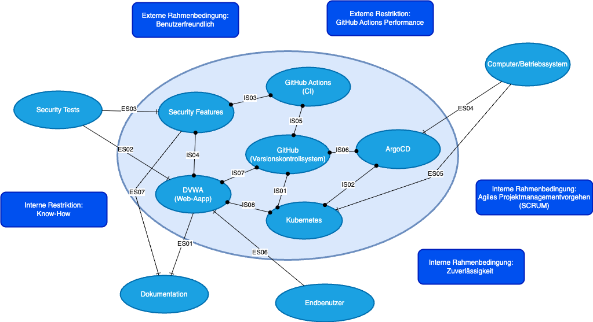

#### Interne-Schnittstellen

| IS  | Definition                                                                                                                          |
| :-- | :---------------------------------------------------------------------------------------------------------------------------------- |
| IS1 | Die Kubnerentes Manifest Files sind auf Github abgelegt. Damit ist sichergestellt das der Code einheitlich und zentral abgelegt ist |
| IS2 | Der Kubnernetes Cluster wird über Argo CD deployed                                                                                 |
| IS3 | Das Docker Image wird in der CI Pipeline auf Schwachstellen und Sicherheitslücken geprüft                                         |
| IS4 | Die Security Features werden auf die Web-Applikation angewendet und prüft die App auf Herz und Nieren                              |
| IS5 | Der GitHub Workflow ist in GitHub zentral abgelegt und steuert die Ausführung der CI Pipeline                                      |
| IS6 | Argo CD ist mit dem GitHub Repo verlinkt. Nur so kann ein sauberer GitOps Prozess funktionieren                                     |
| IS7 | Der Quellcode der Web-Applikation ist im GitHub Repo abgelegt                                                                       |
| IS8 | Die Applikation läuft schlussendlich auf einem Kubnernets Cluster                                                                  |

#### Externe-Schnittstellen

| ES  | Definition                                                                                                                      |
| :-- | :------------------------------------------------------------------------------------------------------------------------------ |
| ES1 | Die aus dem Internet bezogene Applikation bietet eine Dokumentation an, welche für die hier verwendete Weiterarbeit nötig ist |
| ES2 | Alle Security Tests von Drittanbietern werden auf die Webapplikaton angewendet                                                  |
| ES3 | Die Security Tests beinhalten die bereits implemtierten Security Features, welche zuvor in der CI Pipeline definiert sind       |
| ES4 | Argo CD läuft lokal auf dem Computer                                                                                           |
| ES5 | Kubernetes wird lokal mittels minikube ausgerollt                                                                               |
| ES6 | Der Endbenutzer kann die Applikation nutzen und erkennt dabei die Schwachstellen                                                |
| ES7 | Die Securtiy Features werden vollständig dokumentiert                                                                          |

## Ressourcen

«Ressourcen sind nach DIN69902 Personal und Sachmittel, die zur von Vorgängen, Arbeitspaketen und Projekten benötigt werden. Sie können wiederholt oder nur einmal einsetzbar sein. Sie können in wert- oder Mengeneinheiten beschrieben und für einen Zeitpunkt oder Zeitraum disponiert werden.»
(Rohde & Pfetzing, 2020, S.219)

### Ressourcenplanung

Die Ressourcenplanung wird in nicht-verzehrbare und verzehrbare Einsatzmittel unterschieden. Die nicht-verzehrbare Mittel sind Personal und Sachmittel, welche nicht verbraucht werden, sondern eher in Leistungen und Dauer abgerechnet und eingeplant werden.

Die verzehrbaren Einsatzmittel sind hingegen alle Materialien und auch Geldmittel, die während dem Projekt verbraucht werden. Bei diesen Mittel sind neben der Bereitstellung auch wichtig zu planen, wann und wie diese neu beschlaft werden können.

### Nicht-verzehrbare Mittel

- SCRUM Master
- Product Owner
- Developer
- Kubernetes (minikube)
- ArgoCD
- Computer
- GitHub
- SonarQube
- Trivy
- Snyk

### Verzehrbare Mittel

- Storage
- GitHub Runner
- Strom
- Lizenzen
- Zeit

## Risikomanagement

Risikomanagement beschreibt die systematische Identifikation, Analyse, Bewertung und Überwachung von Risiken in Projekten oder Organisationen. Ziel ist es, die negativen Folgen in einem Projekt zu minimieren oder gar zu beseitigen. (ChatGPT, persönliche Kommunikation, 16. Dez. 2024)

### Risikoregister

| Nr. | Risiko                                           | Hauptursache                                                             | Erste Massnahme                              | Eintritt | Auswirkungen | Risikostufe |
| :-- | ------------------------------------------------ | ------------------------------------------------------------------------ | -------------------------------------------- | -------- | ------------ | ----------- |
| 1   | K8s falsch aufgesetzt                            | Deployments, RBAC, Secrets sind falsch konfiguriert                      | mit kubectl cmd troubleshooten               | Mittel   | Hoch         | Hoch        |
| 2   | ArgoCD synchronisiert nicht (Out-of-Sync Fehler) | Fehlende Manifeste oder Berechtigung                                     | ArgoCD Logs prüfen                          | Hoch     | Hoch         | Hoch        |
| 3   | CI-Pipeline schlägt unerwartet fehl             | Syntaxfehler, falsche Tags, Build-Fehler oder fehlende Secretes          | Pipeline schrittweise testen                 | Hoch     | Mittel       | Hoch        |
| 4   | Image Scanner blockiert Workflow Chain           | DVWA deployment wird blockiert, weil es voll mit Schwachstellen ist      | Schwellwerte richtig setzen                  | Hoch     | Niedrig      | Mittel      |
| 5   | Zeitliche Verzögerungen                         | Implementierung & Planung dauert länger als geplant                     | Backlog reduzieren                           | Mittel   | Hoch         | Hoch        |
| 6   | Technische Probleme                              | Unerwartete Probleme tauchen auf                                         | Ressourcen überprüfen & minikube reseten   | Hoch     | Mittel       | Hoch        |
| 7   | Fehlende Dokumentation (nicht aktualisiert)      | Zu starker Fokus auf Realisierung als Dokumentation                      | Dokumentation als DoD überprüfen           | Mittel   | Mitel        | Mittel      |
| 8   | Git Konfilikte                                   | Mehrere Developer arbeiten am gleichen Codeabschnitt                     | Häufig Mergen und kleine Branchen erstellen | Niedrig  | Mittel       | Mittel      |
| 9   | Ausfall externer Dienste                         | GitHub ist nicht erreichbar                                              | Lokale Tests fortsetzen oder Doku verbessern | Niedirg  | Hoch         | Hoch        |
| 10  | Unvollständiges Architekturdiagramm             | Zu ungenaue Vorbereitung des Architekur und fehlendes Check mit Dozenten | Architekturdiagramm überarbeiten            | Mittel   | Hoch         | Hoch        |

### Risikoportfolio

Das Risikoportfolio veranschaulicht die Einflussgrössen der Risiken auf das gesamte Projekt hinweg. Sinn und Zweck ist es dabei eine Einschätzung, der Risikoherde bildlich darzustellen und die Abschätzung zwischen der Eintrittswahrscheinlichkeit und der Schadenshöhe beim Eintreffen des Risikos vorherzusehen.
Aus dem Portfolio ist zu erkennen, dass die Risiken im Projekt mittel bis hoch eingeschätzt werden. Die vielen technischen Komponenten bilden eine grosse Abhängigkeit in Bezug der Umsetzung und Machbarkeit des Projkets.

Des Weiteren zeigt das Portfolio, dass insbesondere technische Fehlkonfigurationen und Zeitverzug das grösste Risiko für den Projekterfolg darstellen. Diese Risiken müssen daher frühzeitig adressiert werden, um den erfolgreichen Abschluss des Proof of Concepts sicherzustellen.
`<br>`

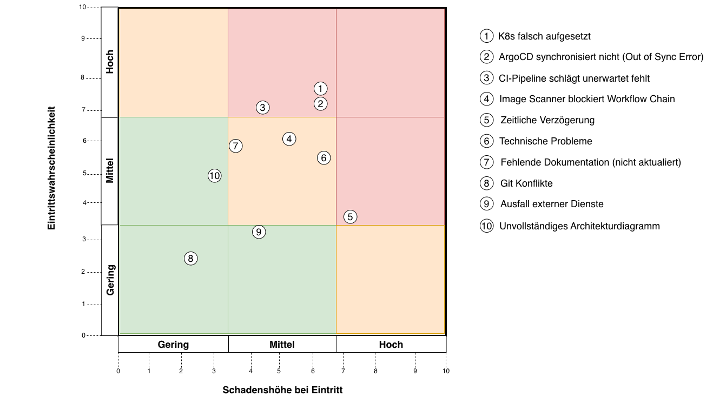

#### Resultierende Nacharbeiten

- Dokumentation zum Einrichten und Aufsetzen des K8s Clusters: [Link](https://kubernetes.io/docs/concepts/overview/)
- Lernvideos zu K8s von KodeKloud: [Link](https://shorturl.at/RRXJS)
- Weitere Recherchen zu ArgoCD tätigen: [Link](https://argo-cd.readthedocs.io/en/stable/)
- Weniger Stories im nächsten Sprint assignen.

## Architekturdiagramm

In meinem Architekturdiagramm wird dargestellt, wie der Security-GitOps-Workflow funktioniert und welche Komponenten daran beteiligt sind.
Im Mittelpunkt stehen zwei Repositories, die den zentralen Ablauf steuern: Das Applikation-Repository für den Build-Stage und die Security-Prüfungen sowie das GitOps-Repository als „Single Source of Truth“ für den gewünschten Deployment-Zustand.
Über GitHub Actions werden Build und Security-Checks ausgeführt und anschliessend die Kubernetes-Manifeste im GitOps-Repository aktualisiert. ArgoCD überwacht das GitOps-Repository und synchronisiert Änderungen automatisiert in den Kubernetes-Cluster, wodurch die neue Version der Applikation ausgerollt wird.

Der Best-Practice-Ansatz mit zwei separaten Repositories entspricht dem Prinzip der GitOps Manifest Segregation und bietet durch die konsequente Isolation des Deployment-Prozesses einen zusätzlichen Schutz.
Durch diese Trennung kann das Deployment unabhängig vom aktuellen Zustand der Codebasis kontrolliert und nachvollziehbar gesteuert werden. Änderungen am Applikationscode führen somit nicht automatisch zu einem Deployment, sondern erst dann, wenn die Kubernetes-Manifeste im GitOps-Repository bewusst aktualisiert werden. Dadurch wird verhindert, dass jede kleinere Codeänderung unmittelbar einen Deployment-Prozess auslöst und es entsteht ein kontrollierter, stabiler und sicherer Bereitstellungsablauf.

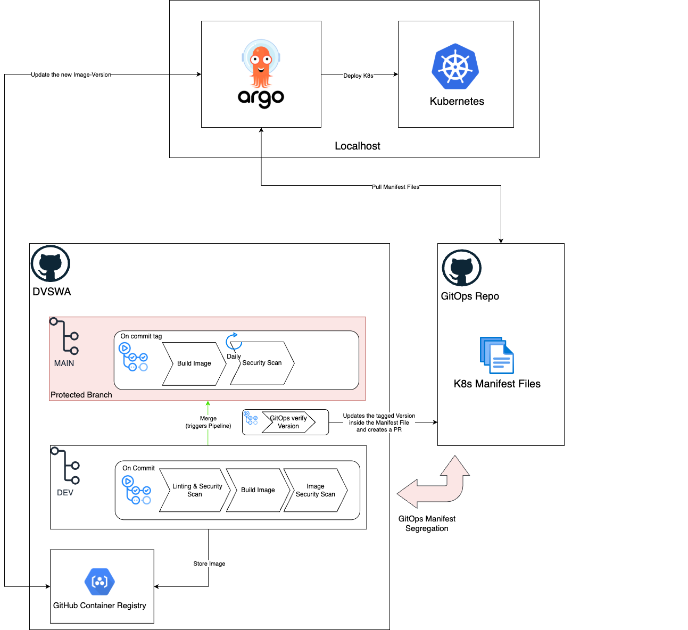

## Security Konzept

Das Security Konzept beschreibt den "Shift Left" Ansatz, in dem das Nutzen von automatisierten Sicherheitstest im kompletten Bereitstellungsprozess integriert wird.
Dabei ist zu beachten das sich die Test in SAST, SCA und DAST von einander Unterscheiden. Sinn und Zweck dieser Tests soll die Aufmerksamkeit gegenüber Sicherheitslücken darstellen und deren Wichtigkeit zur frühen Berreinigung im Etwicklungs und Bereitstellungsphasen.

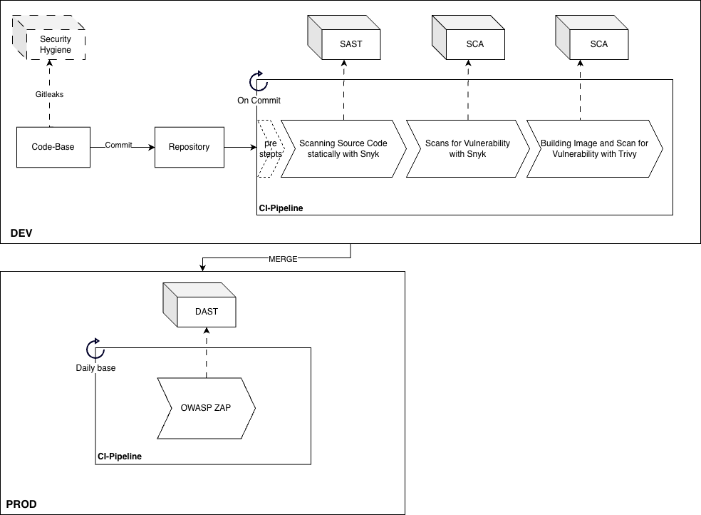

**Gitleaks**: Diese Funktion prüft bereits lokal beim Entwickler, ob Secrets eingecheckt wurden. Damit können ungewollte security breaches verhindert werden.

**SAST**: Static Application Security Testing ist eine Art, wie man die Code Basis auf Sicherheitslücken untersurcht, ohne dabei die Applikation laufen zu lassen. In meinem Konzept wird dabei mit Snyk die Code-Analyse durchgefürht. Hierbei sollen Angriffsmuster, wie XSS, Path Traversal etc. erkennt und alarmiert werden.

**SCA**: In der Software Composition Analysis werden die verwendeten Bibliotheken auf Schwachstellen überprüft und dadurch können potenzielle Angriffe erkennbar gemacht werden. Die Schwachstellen sind mit CVE Nummern gekennzeichnet. Auch in diesem Teil wird auf Snyk zurückgegriffen, ausserdem wird zusächtzlich Trivy gebraucht, damit das gesamte Imgage nochmals auf Sicherheitslücken gesannt wird. Das Resultat soll im GitHub Repo ersichtlich werden.

**DAST**: Dynamic Application Security Testing bezeichnet Sicherheitstests an der laufenden Anwendung. Die Tests ähneln die einem Penetration Testers. Es werden verschiedene Angriffe auf das laufende System unternommen, um Schwachstellen zu erkennen.

## Test Konzept

# Realisierungsphase

## Repositories & Branching

Zu aller Erst muss das DSVPWA Repository von [Gabor Seljan](https://github.com/sgabe/DSVPWA) erfolgreich geklont werden. Anschliessend bereiten wir unser zweites Repo vor, welches wir für unseren GitOps Workflow benötigen. Der Grund warum hier auf zwei verschiedene Repos referenziert wird, ist aus Best Practice Gründen zu verzeichnen. Die GitOps Manifest Segregation zielt dauraf hin, den Source Code von den K8s Files strikt zu trennen. Dadurch können veränderungen an der Applikation vorgenommen werden, ohne Einfluss auf das Deployment zu verursachen. [Quelle](https://gitopsecurity.com/gitOpsManifestSegregation)

> - DSVPWA Repo: https://github.com/taher-alsaegh/DSVPW
> - GitOps Repo: https://github.com/taher-alsaegh/dsvpwa-gitops

Im DSVPWA Repo, wo sich auch der Source Code befindet, wird zusätzlich zur `main` branch eine `dev` branch erstellt. Dort wird wie im Architekturdiagramm zusehen, das Image gebaut und durchläuft die Sicherheitstests. Von dort aus wird das Image mit `dev getagged` und im GitHub Container Registry abgelegt (GHCR).
In der `main` branch wird ausschliesslich der Daily DAST Security Test ausgefürht.

Im GitOps Repo wird ausschliesslich die default `main` branch verwendet.

### Semantic Versioning

Der Ansatz vom Semantic Versioning kurz SemVer ist in dieser Arbeit ebenfalls angewendet. SemVer ist ein vordefiniertes Versionsschema, damit Menschen erkennen, was sich nach einem Update an der Anwendung verändert hat.
Dieses Format wird wie folgt in drei Elementen angezeigt `MAJOR.MINOR.PATCH`. Somit lässt sich nach einem Update den aktuellen Stand, durch die Veränderungselemente erkennen. [Quelle](https://semver.org/lang/de/)

Die Versionierung erfolgt durch `git tags` und lässt sich gut mit dem SemVer Prinziep vereinbaren. Nachdem die Pipeline durchlaufen ist und das Image erfolgreich in `dev`  gebaut wurde, erhält das Image, wie bereits erwähnt automatisch einen `dev tag`.
Sofern die `dev` Version zufriedenstellend ist, kann ein git tag bspw. `v0.1.3` initiiert werden und mit einem `git push origin v0.1.3` auf das Remote Repository ausgeführt werden. Somit erstellen wir eine neue Versionierung des neu gebauten images und liegt ausserdem mit dem `latest` tag im GHCR.
Ausserdem befindet sich eine komplette Versionierung des Repos, welches unter dem Tag Icon zu finden ist.

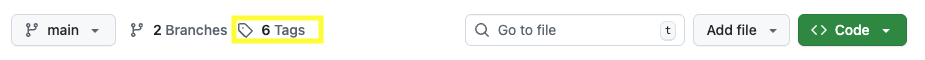


###  Branch Protection & Merge Strategy

Damit keine Commits direkt auf die `main` branch gemacht werden, ist diese mit einer branch protection gesichert. Veränderungen auf der `main` branch können nur via pull requests erzeugt werden. Da es nur eine `dev`branch in diesem Setup verfügbar ist, wird auch nur diese zum mergen freigegeben.

**Konfiguration**

- [X] Restricted deletions
- [X] Require a pull request before merging
- [X] Block force pushes
- [X] Required apporvals: 0

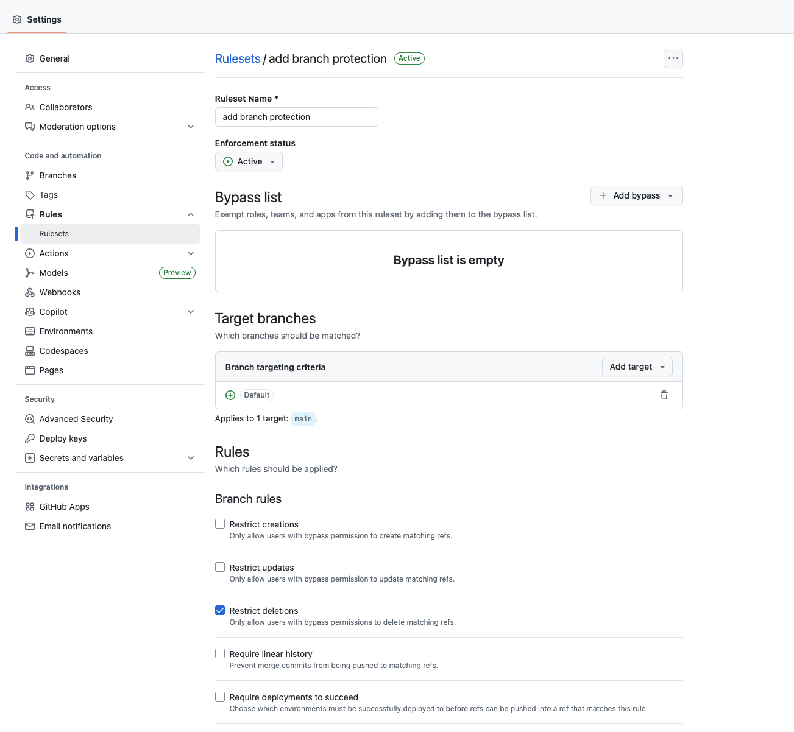

Hier ist die erfolgreiche Implementation der Branch Protection zu sehen. Von der `main` branch können keine Anpassungen vorgenommen werden.

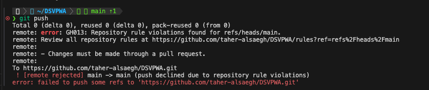

Für die Merge-Strategie wird hier das normale Merge commit Prinzip angewendet. Der Vorteil davon ist, dass die Deployment history durch den merge commit ersichtlich bleibt und die  dev commits nachvollziehbar beleiben.
Hingegen bei anderen Strategien, wie einem Squash Merge gehen die dev commits verloren und die Transparenz in der Semesterarbeit ist nicht gewährleistet.

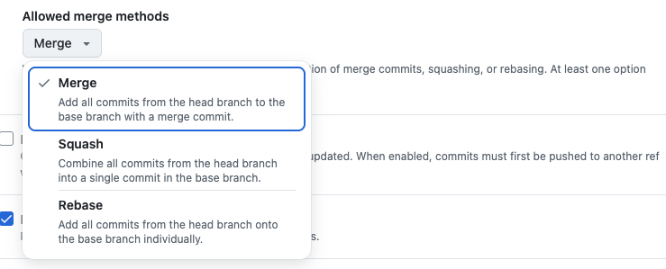

## SAST, SCA and Build & Push Pipline

In diesem Abschnitt wird die erste von Drei Pipelines beschrieben. Dabei handlet es sicht um die Sicherheitstest mit Snyk und dem scannen des Container-Images mit Trivy.

### Linting
Linting ist der Prozess, bei dem ein Programm ausgeführt wird, das den Code auf mögliche Fehler analysiert. Es handelt sich hierbei um eine statische Code-Analyse, die Programmierfehler, Bugs, stilistische Fehler und verdächtige Konstrukte aufdecken soll.

Der erste Teil der Pipeline der durchläuft ist der lint checker. Hierbei werden zunächst die python dependencies isort und black installiert.

**isort check** sortiert die die Imports alphabetisch und trennt die standard Libs von den third parties Libarys. Der Nutzen ist hierbei die Lesbarkeit für den Entwickler.

**black check** formatiert schlussendlich den Code. Einrückungen, Zeilenlänge, Leerzeichen etc. werden alle sauber über einen Style Guide Stadard wie PEP8 formatiert. Das ist wicktig, um mit einen einheitlichen und strukturierten Code zu arbeiten

```yml
jobs:
  lint:
    runs-on: ubuntu-latest
    steps:
      - uses: actions/checkout@v4

      - uses: actions/setup-python@v5
        with:
          python-version: "3.9"
          cache: "pip"

      - name: Install lint deps
        run: |
          python -m pip install --upgrade pip
          pip install black isort

      - name: isort check
        run: isort --check-only .

      - name: black check
        run: black --check .
```

### Snyk

Mit Snyk, einer zusätzlicher externen Anwendungen können Sicherheitsschwachstellen im Code oder in Open-Source-Dependencies automatisiert aufgedeckt und diese auf deren Schweregrad priorisiert werden.

In diesem Schritt wird zunächst der Code auf potenzielle gefährdete Schwachstellen oder Agriffsmuster geprüft. Der SCA-Teil scannt die Dependencies/Libarys auf Schwachstellen.
```yml
snyk:
    runs-on: ubuntu-latest
    needs: lint
    steps:
      - uses: actions/checkout@v4

      # SAST: scannt deinen Code
      - name: Snyk Code (SAST)
        continue-on-error: true
        uses: snyk/actions/python@master
        env:
          SNYK_TOKEN: ${{ secrets.SNYK_TOKEN }}
        with:
          command: code test

      # SCA: scannt Dependencies (requirements/lockfiles)
      - name: Snyk Open Source (SCA)
        continue-on-error: true
        uses: snyk/actions/python@master
        env:
          SNYK_TOKEN: ${{ secrets.SNYK_TOKEN }}
        with:
          command: test

```

### Build & Scan

Damit die Sematic auch für die Versionierung stimmt, wird vor dem Build ein Check durchgeführt, ob die Referenzierung auf dev oder entsprechend des Versionstag übereinstimmt.  

```yml
build_push_and_trivy:
    runs-on: ubuntu-latest
    needs: snyk
    steps:
      - uses: actions/checkout@v4

      - name: Compute image name (lowercase)
        id: img
        shell: bash
        run: |
          echo "image=${{ env.REGISTRY }}/${GITHUB_REPOSITORY,,}" >> "$GITHUB_OUTPUT"
        
      - name: Compute tags + scan target
        id: ver
        shell: bash
        run: |
          # Branch dev => tag "dev" und scan "dev"
          if [[ "${GITHUB_REF}" == "refs/heads/dev" ]]; then
            echo "tags=${{ steps.img.outputs.image }}:dev" >> "$GITHUB_OUTPUT"
            echo "scan_ref=${{ steps.img.outputs.image }}:dev" >> "$GITHUB_OUTPUT"
            exit 0
          fi

          # SemVer tag vX.Y.Z => push "X.Y.Z" + "latest", scan "X.Y.Z"
          if [[ "${GITHUB_REF}" == refs/tags/v* ]]; then
            VERSION="${GITHUB_REF_NAME#v}"
            echo "tags=${{ steps.img.outputs.image }}:${VERSION},${{ steps.img.outputs.image }}:latest" >> "$GITHUB_OUTPUT"
            echo "scan_ref=${{ steps.img.outputs.image }}:${VERSION}" >> "$GITHUB_OUTPUT"
            exit 0
          fi

          echo "Unsupported ref: ${GITHUB_REF}"
          exit 1
```

Da das Minikube Setup auf einer ARM basierten Architektur läuft, müssen die Imges entsprechend kompatibel sein. Dafür werden in GitHub Action die QUMU-Binärdateien genutzt, um die verschiedenen Prozessarchitekturen zu erstellen.

```yml
      # Multi-Arch Build Support (fix für ARM64 Minikube)
      - name: Set up QEMU
        uses: docker/setup-qemu-action@v3

      - name: Set up Docker Buildx
        uses: docker/setup-buildx-action@v3

      - name: Login to GHCR
        uses: docker/login-action@v3
        with:
          registry: ${{ env.REGISTRY }}
          username: ${{ github.actor }}
          password: ${{ secrets.GITHUB_TOKEN }}

      - name: Build & push image (multi-arch)
        uses: docker/build-push-action@v6
        with:
          context: .
          file: ./Dockerfile
          push: true
          platforms: linux/amd64,linux/arm64
          tags: ${{ steps.ver.outputs.tags }}
          cache-from: type=gha
          cache-to: type=gha,mode=max
```


Zu guter Letzt wird mit Trivy das gerade erstelle Image auf weitere Schwachstellen geprüft und mit dem SARIF Format auf Github hochgeladen. So können die Vulnerabilities direkt ausgelesen werden.
```yml
      # Trivy scannt direkt aus der Registry (kein pull nötig)
      - name: Trivy image scan (SARIF)
        uses: aquasecurity/trivy-action@master
        with:
          image-ref: ${{ steps.ver.outputs.scan_ref }}
          format: sarif
          output: trivy-image.sarif

      - name: Upload Trivy SARIF
        uses: github/codeql-action/upload-sarif@v3
        with:
          sarif_file: trivy-image.sarif 
          category: trivy-image
```

## Kubnernetes Setup

### Minikube

Für die K8s installation wird in diesem Fall Minikube verwendet. Minikube eigenet sich sehr gut für das schnelle Aufsetzen eines K8s Clusters und kann sehr einfach lokal betreieben werden. Da die Semesterarbeit ein Proof of Concept darstellt, reicht Minikube für diesen Einsatzzweck vollkommen aus.

Die Virtualisierungsumgebung in dem Minikube läuft auf Ubuntu 24.04.3 LTS und wird mit UTM, einem Virtualisierungsprogramm für MacOS, erstellt.


#### Installation

Nach dem die Virtuelle Maschine Einsatz bereit ist, muss überprüft werden ob weitere Virtualisierungen möglich sind. Hierbei nuzten wir diesen Befehl und sollten keinen Output erwarten:
`egrep --color 'vmx|svm' /proc/cpuinfo` 

Mit diesem Befehl wird Minikube installiert:
`curl -Lo minikube https://storage.googleapis.com/minikube/releases/latest/minikube-darwin-amd64 && chmod +x minikube`

Zu guter Letzt fügen wir die Programmdatei zu userem Pfad hinzu:
`sudo cp minikube /usr/local/bin && rm minikube`

Mit `minikube status` kann der Status des lightweight K8s Clusters überprüft werden.

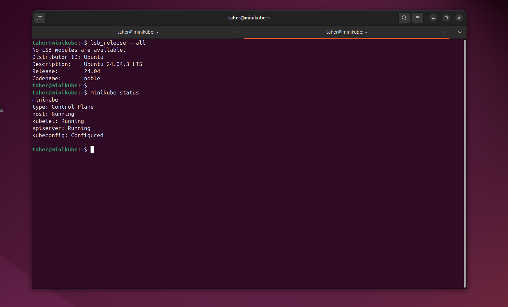 

### ArgoCD

Argo CD ist ein deklaratives, GitOps continuous delivery tool für Kubernetes. ArgoCD wird als Schnitstelle zum GitOps Repo und dem K8s Clusters fungieren. Jegliche Anpassungen auf den K8s Manifest Files triggert eine Veränderung am K8s Deployment.

#### Installation & Konfiguration

Zuerst wird ein Namespace für ArgoCD erstellt und anschliessend kann die Applikation installiert werden.
`kubectl create namespace argocd`

`kubectl apply -n argocd -f https://raw.githubusercontent.com/argoproj/argo-cd/stable/manifests/install.yaml`

Unter dem lokal erstellten Ordner `dsvpwa` ist folgende ArgoCD `app.yml` Konfigurationdatei hinterlegt. Es zielt mein `dsvpwa-gitops.git` Repo an und prüft aktiv, ob es unter dem Pfad `k8s` veränderungen gegeben hat.

Mit `kubectl apply -f app.yml` erstelle ich meine Konfig.

```yml
apiVersion: argoproj.io/v1alpha1
kind: Application
metadata:
  name: dsvpwa
  namespace: argocd
spec:
  project: default
  source:
    repoURL: "https://github.com/taher-alsaegh/dsvpwa-gitops.git"
    targetRevision: main
    path: k8s
  destination:
    server: "https://kubernetes.default.svc"
    namespace: dsvpwa
  syncPolicy:
    automated:
      prune: true
      selfHeal: true
    syncOptions:
      - CreateNamespace=true
```

Mit `kubectl -n argocd get secret argocd-initial-admin-secret -o jsonpath='{.data.password}' | base64 -d; echo` lese ich das initial Passwort aus und mit `kubectl -n argocd port-forward svc/argocd-server 8080:443` kann ich die Portweiterleitung aktiviern sodass ich über localhost:8080 auf mein ArgoCD GUI komme.

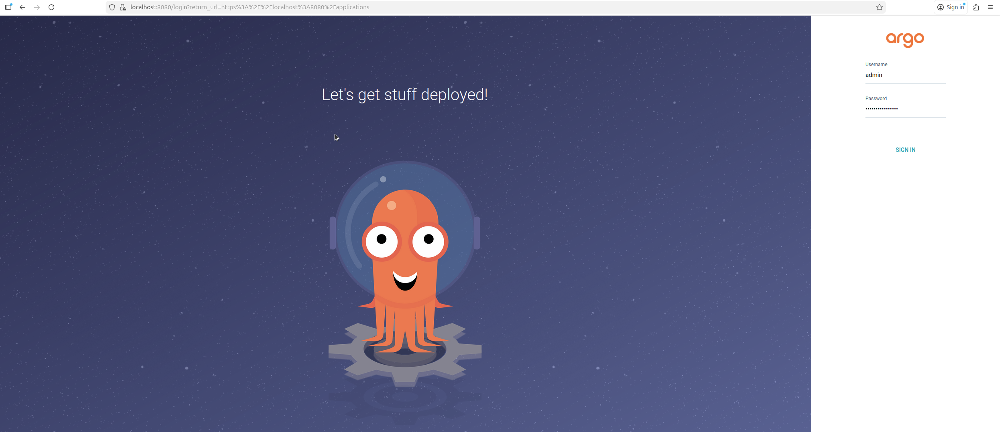

### K8s Manifest Files

Als Kubernets Manifest File versteht man oft Mals ein YAML oder JSON Datei, die den gewünschten Status des Kubernets Objekts darstellen soll. Ein K8s Objekt kann ein Deployment, ReplicaSet, Service usw. sein. Manifest Files definieren die Spezifikationen des Objekts, wie deren Metadata, Eigenschaften oder Zustand in einem deklarativen Ansatz.  

Alle Manifest Files werden im GitOps Repo unter der `main` branch abgelegt.

#### Deployment

Das Deployment ist Zuständig dafür, dass die Pods/Container in dem gewünschten Zustand laufen.

Der Erste Abschnitt weisst im namespace `dsvpwa` jeweils Zwei Replicas auf. Das definert den Zustand von jeweils Zwei Pods. Unter dem Selector `matchLabels: dsvpwa` ist ein Filter definiert. Dieses Merkmal dient dazu das alle Pods unter `app: dsvpwa` den Zustand vom replicas einnehmen. 

``` yml
apiVersion: apps/v1
kind: Deployment
metadata:
  name: dsvpwa
  namespace: dsvpwa
spec:
  replicas: 2
  revisionHistoryLimit: 1
  selector:
    matchLabels:
      app: dsvpwa
  template:
    metadata:
      labels:
        app: dsvpwa
```

Im zweiten Abschnitt des Deployments wird der container definiert. Hier wird das Image eingetragen und die nötigen paramenter zum Starten der Applikation hinterlegt. Auch sieht man auf welchem Port die Applikation exposed wird.

```yml
spec:
      containers:
        - name: dsvpwa
          image: ghcr.io/taher-alsaegh/dsvpwa:0.1.8
          command:
            - python
          args:
            - dsvpwa.py
            - --host
            - "0.0.0.0"
            - --port
            - "65413"
          ports:
            - containerPort: 65413
          env:
            - name: PORT
              value: "65413"
```


#### Service


Ein Service leitet den Traffic über eine Reihe von Pods. Diese können ebenfalls mit Labels gekennzeichnet werden. Der Service ermöglicht der Anwendung, Datenverkehr zu empfangen und dient daher als Schnittstelle für die Kommunikation zur Applikation.

Auch hier werden alle Pods mit dem Selector Label dsvpwa getrackt. Als Expose Methode wird `ClusterIP` genutzt. Hierbei wird der Service nur im internen Cluster verfügbar gemacht.
```yml
apiVersion: v1
kind: Service
metadata:
  name: dsvpwa
  namespace: dsvpwa
spec:
  selector:
    app: dsvpwa
  ports:
    - name: http
      port: 65413
      targetPort: 65413
  type: ClusterIP
```

#### Certificates

Mit einem Zertifikat kann eine sichere TLS Verschlüsselung hergestellt werden. Sie dient als digitales "Ausweisdokument" und bildet den handshake für eine sichere Webkommunikation über HTTPS.

In dieser Arbeit wird ausschliesslich ein lokales Setup gebaut. Daher ist dieser Teil mit dem Zeritifikat rein als Showcase zu betrachten. Es soll vielmehr die herangehensweise für das online Stellen einer Webanwendung beschreiben.

Wir initialisieren eine interne CA mit einem self-signed Issuer, erzeugen daraus einen CA-basierten ClusterIssuer und lassen cert-manager daraus automatisch TLS-Zertifikate für Services erstellen. So integrieren wir TLS vollständig in den Kubernetes-Lifecycle

##### Cert-Manager

Der Cert-Manager ist zwingend nötig, um das Zertifikat automatisiert über Kubnernetes zu erstellen. Ausserdem ist dieser Zuständig für die Erneuerung des Zertifikats und sichert die TLS Datei unter den Secrets. Ohne Cert-Manager müsste man bei jeder Änderung manuell ein neues Cert über OpenSSL erzeugen und es zu den secrets hinzufügen.

###### Installation

In diesem Schritt wird ein zusätzlicher namespace für den Cert-Manager angelegt und anschliessend über helm installiert.

```sh
helm repo add jetstack https://charts.jetstack.io
helm repo update
kubectl create namespace cert-manager
helm install cert-manager jetstack/cert-manager \
  --namespace cert-manager \
  --set crds.enabled=true
```

Hier ist der aktive Cert-Manager zu sehen, welcher mit Drei Pods im seperaten namespace läuft.
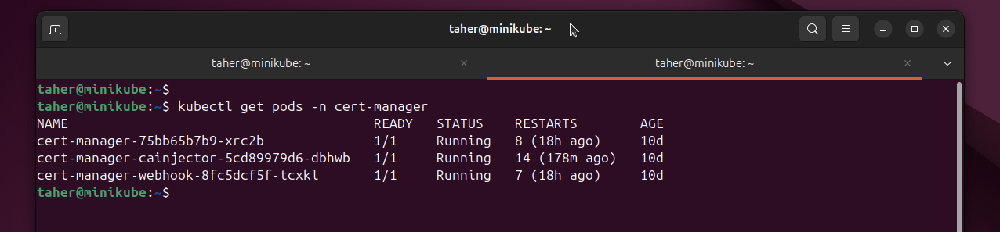

##### SelfSigned ClusterIssuer

Mit dem SelfSigned ClusterIssuer wird das Zertifikat von mir selbst signiert. In einem realen Setup würde diese CA natürlich nicht jemand selbst sein, sondern im besten Fall eine anerkannte Certificate Authority Stelle, wie beispielsweise Let's Encrypt.

```yml
kind: ClusterIssuer
metadata:
  name: selfsigned
spec:
  selfSigned: {}
```

##### Root-CA erzeugen

Hiermit erstlle ich die von mir definierte CA Stelle über den Cert-Manager. Es wird ein ein `local-root-ca` key-pair erstellt, um damit als vermeintliche CA Zertifikate signieren zu können.

```yml
apiVersion: cert-manager.io/v1
kind: Certificate
metadata:
  name: local-root-ca
  namespace: cert-manager
spec:
  isCA: true
  commonName: local-root-ca
  secretName: local-root-ca-secret
  issuerRef:
    name: selfsigned
    kind: ClusterIssuer
```

##### CA-Issuer

In diesem Schritt wird der cert-manager angewiesen, den ca-schlüssel `local-root-ca-secret` zu nutzen, um Zertifikate zu signieren. Dieser Schlüssel wird Kubernetes nie verlassen. Somit wird dieser Schlüssel intern vom Cert-Manager genutzt.

```yml
apiVersion: cert-manager.io/v1
kind: ClusterIssuer
metadata:
  name: local-ca-issuer
spec:
  ca:
    secretName: local-root-ca-secret
```

##### Signed Certificate

Der Cert-Manager signiert nun über den `local-ca-issuer` das Zertifikat. Dieses Zertifikat ist nun als secret `dsvpwa-tls` in K8s aktiv.

```yml
apiVersion: cert-manager.io/v1
kind: Certificate
metadata:
  name: dsvpwa-local-cert
  namespace: dsvpwa
spec:
  secretName: dsvpwa-tls
  dnsNames:
    - dsvpwa.local
  issuerRef:
    name: local-ca-issuer
    kind: ClusterIssuer
```

Der Status kann wie auf dem Bild leicht zu erkennen, abgefragt werden.

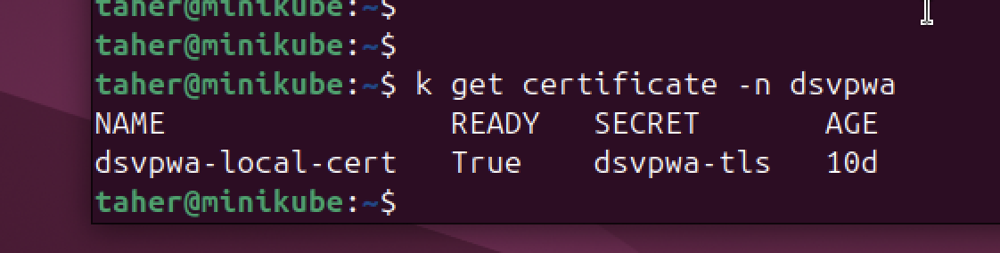


#### Ingress

Da die Anwendung nicht mehr über localhost erreicht werden soll, sondern über einen lokalen Host-Eintrag und HTTPS, benötigt es hier einen Ingress. Bisher hat es bis zum OSI-Layer 4 gereicht, um mit einem Port-Forwarding mittels TCP/IP auf die Applikation zuzugreifen. Mit dem TLS und dem HTTP protokoll kann der Service nichts mehr anfangen.

Aus diesem Grund muss ein Ingress implementiert werden, der das TLS Zertifikat ausliest und auf HTTPS terminiert.
```yml
apiVersion: networking.k8s.io/v1
kind: Ingress
metadata:
  name: dsvpwa
  namespace: dsvpwa
  annotations:
    nginx.ingress.kubernetes.io/ssl-redirect: "true"
spec:
  tls:
    - hosts:
        - dsvpwa.local
      secretName: dsvpwa-tls
  rules:
    - host: dsvpwa.local
      http:
        paths:
          - path: /
            pathType: Prefix
            backend:
              service:
                name: dsvpwa
                port:
                  number: 65413
```

Damit die Applikation nicht über localhost angesteuert werden muss, wird zusätzlich ein Host-Eintrag gemacht, sodass die Seite über https://dsvpwa.local aufgerufen werden kann.

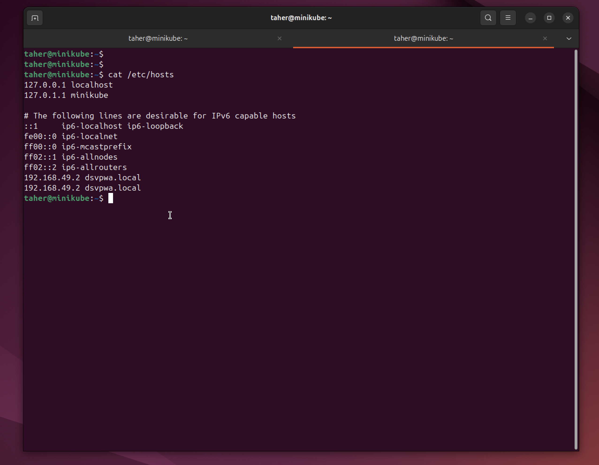

## Daily DAST Pipeline
Dynamic Application Security Testing (DAST) bezeichnet Sicherheitstests, die gegen eine laufende Anwendung durchgeführt werden. Der Test erfolgt zur Laufzeit und simuliert das Verhalten eines externen Angreifers.

DAST-Scanner behandeln die Anwendung als Blackbox. Das bedeutet, sie haben keinen Zugriff auf den Quellcode und interagieren ausschliesslich über öffentlich erreichbare Schnittstellen wie HTTP-Endpunkte oder Web-Oberflächen.
Typische getestete Schwachstellen sind unter anderem SQL-Injection, XSS, Brute-Force etc. Das Ergebnis des Tests wird mit einem Raport festgehalten und veranschaulicht eine Zusammenfassung der erfolgten Angriffe.

In dieser Arbeit kann DAST nicht auf die laufende Anwendung ausgeführt werden, da die Webapplikation von extern nicht erreichbar ist.
Aus diesem Grund wird das Image aktuelle Image verwendet und so auf Schwachstellen geprüft.

Der Test läuft jeden Tag, um ca. 05:00 MEZ ab und ist mit einem cron job eingerichtet. Ausserdem läuft der Test bei jedem commit auf dev erneut ab. Sommit kann der Entwickler den Test-Raport vor der Veröffentlichung der Version einsehen.

```yaml
name: Daily DAST (OWASP ZAP)

on:
  push:
    branches: [dev]
  schedule:
    - cron: "0 4 * * *"   # UTC
  workflow_dispatch: {}

permissions:
  contents: read
  packages: read
```

In diesem Teil wird das Image von der Container Registry gepullt. Anschliessend wird der Container gestartet und mit einem for loop geprüft, ob die Anwedung bereit ist. Mit einer erfolgreichen HTTP-Antwort wird nun der weitere Teil der Pipeline abfolgen.

```yml
jobs:
  zap:
    runs-on: ubuntu-latest
    env:
      IMAGE: ghcr.io/${{ github.repository_owner }}/dsvpwa:latest
      TARGET: http://127.0.0.1:65413

    steps:
      - name: Login to GHCR
        uses: docker/login-action@v3
        with:
          registry: ghcr.io
          username: ${{ github.actor }}
          password: ${{ secrets.GITHUB_TOKEN }}

      - name: Pull image
        run: docker pull "${IMAGE}"

      - name: Run app container
        run: |
          docker rm -f dsvpwa 2>/dev/null || true
          docker run -d --rm --name dsvpwa \
            -p 65413:65413 \
            -e DSVPWA_PORT=65413 \
            "${IMAGE}"

          for i in {1..30}; do
            curl -fsS "${TARGET}" >/dev/null && exit 0
            sleep 2
          done

          echo "App did not become ready. Logs:"
          docker logs dsvpwa || true
          exit 1

```
Nun wird der full scan vom ZAP (Zed Attack Proxy) durchgeführt. Auch hier wird ein Container hochgefahren und auf unser localhost-Targen referenziert. Alle Test-Angriffe werden auf die in der Pipeline definierten TARGET-Adresse durchgeführt.
Am Ende des Tests wird ein Raport als ZIP-Datei beigefügt.

```yml
      - name: ZAP full scan (active)
        run: |
          set +e
          docker run --rm --network host --user 0:0 \
            -v ${{ github.workspace }}:/zap/wrk \
            ghcr.io/zaproxy/zaproxy:stable \
            zap-full-scan.py -t "${TARGET}" -r zap-full.html -J zap-full.json
          echo "ZAP exit code: $?"
          exit 0

      - name: List reports
        if: always()
        run: ls -la

      - name: Upload ZAP reports
        if: always()
        uses: actions/upload-artifact@v4
        with:
          name: zap-report
          path: |
            zap-full.html
            zap-full.json

      - name: Stop app
        if: always()
        run: docker stop dsvpwa || true
```

## GitOps Image verification Pipeline

Nun soll nach jeder Versionänderung (nach jedem Merge von dev -> main) die Version auf den Manifest Files angepasst werden, damit der K8s Cluster auf der aktuellen Version läuft. Um diese Idee umzusetzen benötigen wir eine weitere Pipeline, die bei jdedem Merge auf main getriggert wird und die Versionsüberprüfung durchführt und unter dem Manifest File im Gitops Repo aktuallisiert.

Im folgenden Abschnitt der Pipeline wird das aktulle DSVPWA Repo geklont und im nächsten Schritt werden die git tags mit dem remote repo gefetched. Anschliessend wird die aktuellste Version als Variabel gespeichert. Mit einem conditional statement wird der Tag auf die Semantik überprüft. Im lezten Teil des runs wird die Version auf die GitHub Variabel weitergeleitet, damit im späteren Ablauf darauf zugegriffen werden kann.

```yml
name: Auto-update GitOps image version via PR

on:
  push:
    branches: [main]
  workflow_dispatch: {}

permissions:
  contents: read

jobs:
  bump-gitops:
    runs-on: ubuntu-latest

    steps:
      - name: Checkout app repo (tags)
        uses: actions/checkout@v4
        with:
          fetch-depth: 0

      - name: Determine latest semver tag (vX.Y.Z)
        id: latest
        shell: bash
        run: |
          git fetch --tags --force
          TAG="$(git tag -l 'v*.*.*' --sort=-v:refname | head -n1)"
          if [ -z "$TAG" ]; then
            echo "No semver tags found (vX.Y.Z)."
            exit 1
          fi
          VER="${TAG#v}"
          echo "ver=$VER" >> "$GITHUB_OUTPUT"
          echo "Latest version: $VER"
```

Zunächst wird das `deployment.yml` file ermittelt. Anschliessend wird mit `sed` die neue version ersetzt. `([^@[:space:]]+)` definert den aktuellen tag. `(@sha256:[a-f0-9]+)?` soll ebenfalls beachtet werden, falls das Image weder dev oder einen Versions tag hat. @sha256 bezieht sich auf das spezifische Image im GHCR.

`grep -nE '^\s*image:\s*' "$FILE" || true` gibt die Zeilennummer retour, von wo die Änderung gemacht wird. Im letzten Teil wird abgefangen, ob es überhaupt eine Änderung an der Datei gegeben hat.
```yml
          
      - name: Checkout GitOps repo
        uses: actions/checkout@v4
        with:
          repository: taher-alsaegh/dsvpwa-gitops
          ref: main
          path: gitops
          token: ${{ secrets.GITOPS_TOKEN }}

      - name: Update image tag in GitOps deployment
        id: patch
        shell: bash
        run: |
          FILE="gitops/k8s/deployment.yml"
          if [ ! -f "$FILE" ]; then
            echo "GitOps deployment not found at $FILE"
            exit 1
          fi

          VER="${{ steps.latest.outputs.ver }}"

          # Ersetzt :<tag> und entfernt optional @sha256:
          sed -i -E "s|(image:\s*ghcr\.io/[^[:space:]]+/dsvpwa:)[^@[:space:]]+(@sha256:[a-f0-9]+)?|\1${VER}|g" "$FILE"

          echo "New image line:"
          grep -nE '^\s*image:\s*' "$FILE" || true

          if git -C gitops diff --quiet; then
            echo "No change needed."
            echo "changed=false" >> "$GITHUB_OUTPUT"
          else
            echo "changed=true" >> "$GITHUB_OUTPUT"
          fi
```
In diesem Bereich des Codes wird sichergestellt, dass die Änderung mittels PR und einem sauberen Kommentar ausgeführt wird.

```yml
      - name: Create Pull Request in GitOps repo
        if: steps.patch.outputs.changed == 'true'
        uses: peter-evans/create-pull-request@v6
        with:
          token: ${{ secrets.GITOPS_TOKEN }}
          path: gitops
          commit-message: "gitops: update dsvpwa image to ${{ steps.latest.outputs.ver }}"
          branch: "update-dsvpwa-${{ steps.latest.outputs.ver }}"
          delete-branch: true
          title: "gitops: update dsvpwa image to ${{ steps.latest.outputs.ver }}"
          body: |
            Auto-generated update after merge to main in app repo.
            - sets image tag to `${{ steps.latest.outputs.ver }}`
            - keeps GitOps in sync with latest release
          base: main
```

## Testing

#### 1. Test: Security Scan & Image Build in Dev

| Testfall               | Security Scan & Image Build in Dev                                                                                                                                                                                                                                                                                    |
| ---------------------- | --------------------------------------------------------------------------------------------------------------------------------------------------------------------------------------------------------------------------------------------------------------------------------------------------------------------- |
| Testbeschreibung       | 1. Pipeline durchläuft den Security Scan und Image Build Teail in der dev branch                                                                                                                                                                                                                                           |
| Erwartets Ergebnis     | Die Pipeline wird durch einen Commit getriggert. Dabei soll zunächst der SAST & SCA Scan durchlaufen und anschliessend das Image mit dem dev tag gebuildet werden. Am Ende läuft ein Image Security Scanner durch und prüft auf potenzielle Schwachstellen. Das Image wird in der Github Container Registry abgelegt. |
| Tatsächliches Ergebnis | 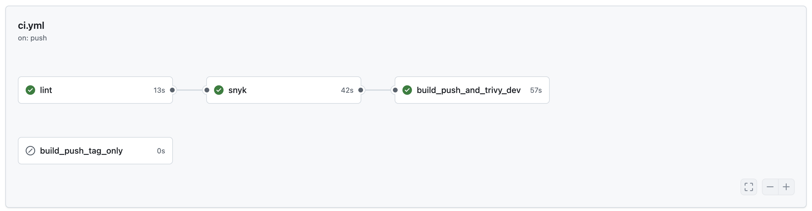 [GHCR](https://github.com/taher-alsaegh/DSVPWA/pkgs/container/dsvpwa)                                                                                                                                                                                                                                                                       |
| Status                 | Erfolgreich                                                                                                                                                                                                                                                                                                           |

#### 2. Test: Image Build mit Version Tag

| Testfall               | Image Build mit Version Tag                                                                                                                                                                                                                                                                        |
| ---------------------- | -------------------------------------------------------------------------------------------------------------------------------------------------------------------------------------------------------------------------------------------------------------------------------------------------- |
| Testbeschreibung       | Image mit korrektem Versionstag wird erstellt und in der Container Registry abgelegt                                                                                                                                                                                                               |
| Erwartets Ergebnis     | Der `git push origin tag vx.x.x` Befehl triggert die CI Pipeline und erstellt das neue Image mit der korrekten Versionierung. Die Pipeline ignoriert die zuvor durchlaufenen Steps, die nach einem commit in dev getriggert werden, um so unnötige Wiederholungen zu vermeiden und Zeit zu sparen. |
| Tatsächliches Ergebnis | 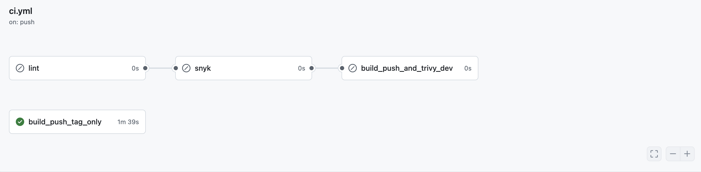 [GHCR](https://github.com/taher-alsaegh/DSVPWA/pkgs/container/dsvpwa)                                                                                                                                                                                                                                             |
| Status                 | Erfolgreich                                                                                                                                                                                                                                                                                        |

#### 3. Test: Automated Image verification

| Testfall               | Automated Image verification                                                                                                                                                                                                                                          |
| ---------------------- | --------------------------------------------------------------------------------------------------------------------------------------------------------------------------------------------------------------------------------------------------------------------- |
| Testbeschreibung       | Der Versionsstand des Images wird nach einem Merge durch die 2. Pipeline auf main geprüft und gegebenenfalls im K8s Deployment angepasst.                                                                                                                                                                                                                                                                      |
| Erwartets Ergebnis     | Nachdem von dev auf main germerged wurde läuft die 2. Pipeline automatisch durch. Dabei wird der aktuelle Versionsstand im K8s Deployment File, falls nötig angepasst. Mit einem Refresh auf ArgoCD wird das neue Image via `RollingUpdate` Strategy Type ausgerollt. |
| Tatsächliches Ergebnis | 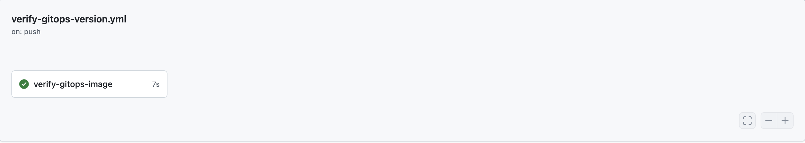                                                                                                                                                  |
| Status                 | Erfolgreich                                                                                                                                                                                                                                                           |

#### 4. Test: Daily DAST Job

| Testfall               | Automated Image verification                                                                                                                                                                                                                                          |
| ---------------------- | --------------------------------------------------------------------------------------------------------------------------------------------------------------------------------------------------------------------------------------------------------------------- |
| Testbeschreibung       | Die 3. Pipeline wird alle 24h automatisch angestossen und fürht den DAST Scann durch                                                                                                                                                                                                                                                                      |
| Erwartets Ergebnis     | Jeweils um 05:00 morgens läuft der DAST job durch und erstellt einen Raport von allen ausgeführten Angriffen. |
| Tatsächliches Ergebnis | 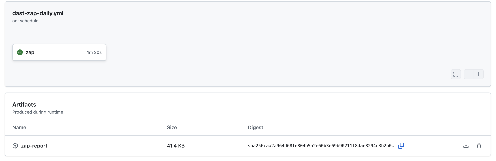 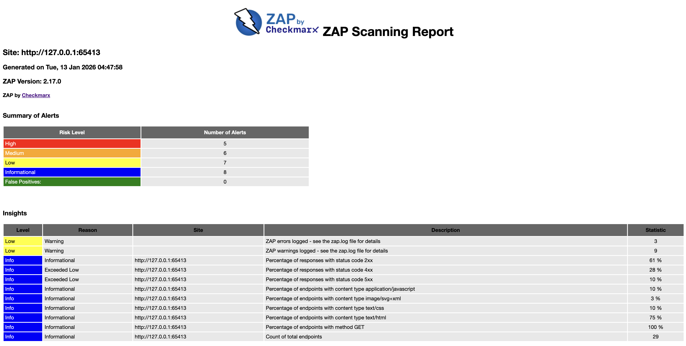                                                                                                                                             |
| Status                 | Erfolgreich  

#### 5. Test: K8s Setup

 Testfall               | Automated Image verification                                                                                                                                                                                                                                          |
| ---------------------- | --------------------------------------------------------------------------------------------------------------------------------------------------------------------------------------------------------------------------------------------------------------------- |
| Testbeschreibung       | Kubernetes läuft über Minikube auf einer VM mit ArgoCD                                                                                                                                                                                                                                                           |
| Erwartets Ergebnis     | Das Kubernetes Setup in Minikube läuft auf einer virtuellen Maschine und ist mit ArgoCD für den Deployment aufgerüstet. Alle Änderungen im GitOps Repository führen zu einer Zustandsveränderung im K8s Deployment. |
| Tatsächliches Ergebnis | 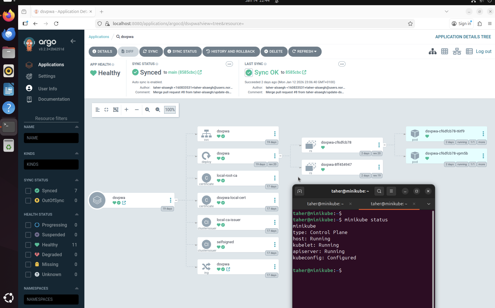                                                                                                                                       |
| Status                 | Erfolgreich  


# Einführungsphase

## Fazit

Im Rahmen dieser Semesterarbeit wurde eine vollständige und praxisnahe DevSecOps-Pipeline für eine containerbasierte Webanwendung konzipiert und technisch umgesetzt. Die Umsetzung erfolgt als Proof of Concept für ein fiktives Unternehmen und orientiert sich an realen industriellen Best Practices.

Die zu Beginn formulierte Fragestellung:
*Wie kann mithilfe von GitOps (Argo CD) und integrierten Sicherheitsprüfungen, wie Trivy, ein sicherer, reproduzierbarer und automatisierter Deployment-Prozess für containerisierte Webapplikationen in Kubernetes realisiert werden?*

kann wie folgt beantwortet werden:

Ein sicherer, reproduzierbarer und automatisierter Deployment-Prozess wird erreicht, indem Git als einzige Wahrheitsquelle (Single Source of Truth) genutzt wird und sämtliche Änderungen – sowohl am Anwendungscode als auch an der Kubernetes-Konfiguration – versioniert und nachvollziehbar erfolgen.
Die Integration von Sicherheitsprüfungen direkt in die CI-Pipeline stellt sicher, dass potenzielle Schwachstellen frühzeitig erkannt werden. SAST- und SCA-Scans analysieren Quellcode und Abhängigkeiten bereits vor dem Build, während Trivy Container-Images auf bekannte Sicherheitslücken überprüft. Ergänzend dazu ermöglicht DAST mit OWASP ZAP die Analyse der Anwendung aus externer Angreiferperspektive, wodurch auch Konfigurations- und Laufzeitschwächen identifiziert werden können. Durch den Einsatz von versionierten Container-Images wird gewährleistet, dass Deployments reproduzierbar sind und Änderungen gezielt und kontrolliert ausgerollt werden. Die Trennung zwischen Applikations-Repository und GitOps-Repository erhöht zusätzlich die Sicherheit und Transparenz, da Deployments ausschliesslich über explizite Änderungen an den Manifest Dateien erfolgen.

Zusammenfassend zeigt die Arbeit, dass die Kombination aus GitOps (Argo CD), automatisierten Sicherheitsprüfungen und Kubernetes-basierter Bereitstellung einen robusten, auditierbaren und skalierbaren Deployment-Prozess ermöglicht, der den Anforderungen moderner Cloud-nativer Anwendungen gerecht wird.

### Evaluation / Zielerreichung

## Reflexion

### Lesson Learned

## Aussicht

# Literaturverzeichnis

# Anhang
