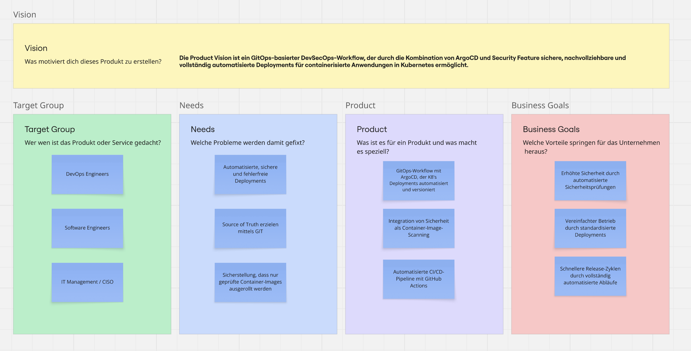

* [ ] Titelblatt
* [ ] Management Summary / Abstract

# Initialisierungsphase

## Einleitung
Im Rahmen meiner 4. Semesterarbeit an der Technischen Berufsschule Zürich soll ein GitOps Workflow auf Kubnernetes realisiert werden. Die Arbeit legt dabei besonderen Wert auf den Sicherheitsaspekt verfolgt dem Prinzip von DevSecOps. Als Proof of Concept, später auch PoC gennant, soll die zentrale Frage: _Wie kann mithilfe von GitOps (ArgoCD) und integrierten Sicherheitsprüfungen, wie Trivy ein sicherer, reproduzierbarer und automatisierter Deployment-Prozess für containerisierte Webapplikationen in Kubernetes realisiert werden? beantwortet werden._ beantwortet werden.

### Ausgangslage & Motivation

In der modernen Softwareentwicklung steigen die Anforderungen an Automatisierung, Sicherheit und Nachvollziehbarkeit entlang des gesamten Softwarebereitstellungsprozesses. Traditionelle CI/CD-Prozesse bieten zwar bereits eine gewisse Automatisierung, jedoch fehlt häufig eine integrierte Sicherheitsüberprüfung und eine vollständige Rückverfolgbarkeit von Änderungen bis in die Produktionsumgebung.
Insbesondere bei containerisierten Anwendungen in Kubernetes-Clustern besteht das Risiko, dass unsichere oder veraltete Container-Images im Betrieb genutzt.
Herkömmliche Deployments erfordern oftmals manuelle Eingriffe durch Entwickler oder Administratoren, was Fehleranfälligkeit begünstigen.

Die fiktive Firma Kubinet AG betreibt mehrere containerisierte Webapplikationen in einem Kubernetes-Cluster.
Der aktuelle Deployment-Prozess erfolgt manuell über ein klassisches CI/CD-System (Github Actions) ohne zentrale Sicherheitsprüfung oder automatische Validierung der Container-Images.
Dadurch besteht die Gefahr, dass fehlerhafte oder unsichere Images deployed werden, was sowohl Compliance-Vorgaben als auch Betriebssicherheit gefährdet.

Das Unternehmen möchte den Bereitstellungsprozess modernisieren, indem ein GitOps-basierter Workflow eingeführt wird, welcher Sicherheitsüberprüfungen, wie Trivy integriert, Deployments automatisiert (ArgoCD) und sämtliche Änderungen nachvollziehbar im Git-Repo dokumentiert.

### Product Vision
Die Product Vision beschreibt kurz und klar, wofür ein Produkt existiert und welchen Nutzen es liefern soll. Im unteren Bild wurde ein Product Vision Board nach Roman Pichler erstellt, um das Produkt ganzheitlich zu verstehen und zu planen. Es ist deutlich detaillierter, konkreter und umfangreicher als die Vision selbst.

[Quelle](https://www.romanpichler.com/blog/the-product-vision-board/)

### Nicht Teil der Arbeit (Out of Scope)

Das Erarbeiten der webbasierten Flask Applikation ist nicht Teil dieser Arbeit und wird daher nicht im Detail erläutert. Bestandteile wie, ERM, Sequenzdiagramm oder UML fallen hier weg, da diese Bereiche, den Rahmen der Arbeit sprengen würden. 

Die Webapp ist sehr simple aufgebaut und dient daher nur als Mittel zum Zweck. Auch hier soll der Security Fokus weiterverfolgt werden und entsprechend ein einfaches Security Tool implementiert werden.

## Projektmanagement

## Projektorganisation

### Projektrollen

## Projektziele

### IST-Analyse

### SOLL-Analyse (Systemziele)

### SAMAT-Ziele

## Abwicklungsziele

### Definition of Done (DoD)

### Meilensteine

## Roadmap / Releases-Planning

### 1. Sprint vom xx.xx - xx.xx.2025

Als Table mit den Stories/Tasks und Akzepttanzkriterien und Sprint Goals

### 2. Sprint vom xx.xx - xx.xx.2025

Als Table mit den Stories/Tasks und Akzepttanzkriterien

### 3. Sprint vom xx.xx - xx.xx.2025

Als Table mit den Stories/Tasks und Akzepttanzkriterien

## Anforderungsdefinition

### Funktionale Anforderung

### Nicht-funktionale Anforderungen

# Konzeptionsphase

## Theoretische Grundlagen

- CI/CD
- Kubnernetes & ArgoCD
- Security Aspekte (Trivy & DevSecOps)
- GitHub Actions
- Flask

## Systemgrenzen

### SEUSAG

#### Interne-Schnittstellen

#### Externe-Schnittstellen

## Ressourcen

### Ressourcenplanung

### Nicht-verzehrbare Mittel

### Verzehrbare Mittel

## Risikomanagement

### Risikoregister

### Risikoportfolio

## GitOps Konzept

## Security Konzept

### Evaluation von Trivy etc.

## Test Konzept

# Realisierungsphase

## GitHub-Repository & Branching

## FlaskApp & Tests

## App in Docker

## CI/CD Pipeline

## Kubernetes minikube & ArgoCD implementation

## Security implementation

- Trivy implementieren
- Secret Management
- RBAC / Least Privilege

## Post Deploy Smoke Tests

# Einführungsphase

## Fazit

### Evaluation / Zielerreichung

## Reflexion

### Lesson Learned

## Aussicht

# Literaturverzeichnis

# Anhang
