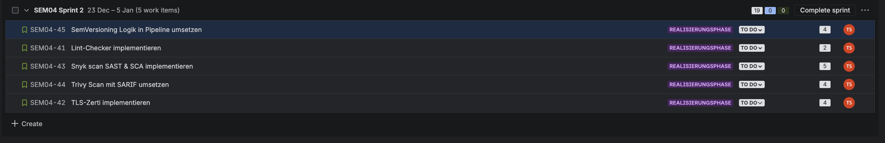

# 2. Sprint vom 23.12 - 05.01

| Story                               | Akzeptanzkriterium                       | Points |
| :---------------------------------- | :--------------------------------------- | :----- |
| Lint-Checker implementieren         | [SEM04-41](https://tinyurl.com/3sj8kkrh) | 2      |
| TLS-Zerti implementieren            | [SEM04-42](https://tinyurl.com/4a5js6ad) | 4      |
| Snyk scan SAST & SCA implementieren | [SEM04-43](https://tinyurl.com/fhrusvu9) | 5      |
| Trivy Scan mit SARIF umsetzen       | [SEM04-44](https://tinyurl.com/5ecnyus4) | 4      |
| SemVersioning Logik umsetzen        | [SEM04-45](https://tinyurl.com/3zb3xunf) | 4      |

**Sprint Goal**: Am Ende des Sprints wird die Anwendung automatisiert als sicheres Container-Image gebaut und versioniert.

# Sprint Review

1. **Zielerreichung**  
   a. Wurde das Sprint-Ziel erreicht?  
   Am Ende des Sprints wurde das Ziel erreicht. Dev wie auch von Main Branch, bekomme ich ein entsprechendes Container-Image mit dem korrekten Tag.  

   b. Welche User Stories wurden vollständig umgesetzt?  
   Alle Stories wurden erfolgreich umgesetzt.

2. **Produktinkrement**  
   a. Was wurde im Sprint konkret geliefert?  
   In diesem Sprint wurden die Sicherheitstests zu der Pipeline integriert und der Kubernetes Cluster wurde um ein Ingress mit TLS Zertifikat erweitert.

   b. Welche Funktionalitäten sind produktiv nutzbar?  
   Sicherheits-Checks werden ausgegeben und können im detail analysiert werden.

3. **Abweichungen & offene Punkte**  
   a. Welche geplanten Inhalte konnten nicht umgesetzt werden?  
   Keine

   b. Warum wurden diese Inhalte nicht abgeschlossen?  
   Keine
   
   c. Müssen Stories in den nächsten Sprint übernommen werden?  
   Es werden keine Stories übernommen. 

# Sprint Retrospektive

## Liked

- Die Integration von SAST-, SCA- und Container-Scans verlief stabil und ohne grössere technische Probleme. 
- Die SemVer-Logik funktioniert zuverlässig für Dev und Main-Branch und sorgt für entsprechnde Image-Tags.
- Die Erweiterung des Kubernetes-Clusters um Ingress mit TLS konnte erfolgreich umgesetzt werden.

## Leared

- Sicherheitsprüfungen müssen früh in der Pipeline integriert werden, um spätere Fehler und Mehraufwand zu vermeiden. (Shift Left)
- GitHub Actions bietet ausreichend Flexibilität, erfordert aber saubere Bedingungen, um unerwünschte Pipeline-Läufe zu vermeiden. Zum Beispeil mit der Commit-Technik: git commit -m "string" [skip ci]
- SARIF-Reports erleichtern die strukturierte Auswertung von Security-Scans erheblich.

## Lacked

- Auf die Security Findings spezifischer eingehen

## Longed for

- Integration von DAST (OWASP ZAP) zur Laufzeitsicherheitsprüfung.
- Besseres Aufbereiten der Security Checks/Findings 
