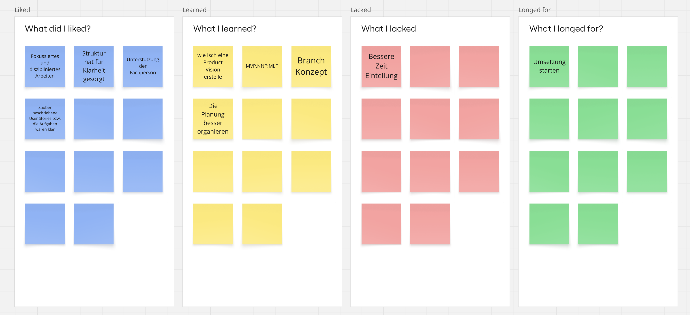

# 1. Sprint vom 12.11 - 08.12

| Story                               | Akzeptanzkriterium                 | Points |
| :---------------------------------- | :--------------------------------- | :----- |
| Einfürhung schreiben               | [SEM04-5](https://shorturl.at/voJ7B)  | 1      |
| Projektmanagement erläutern        | [SEM04-6](https://shorturl.at/nkYM0)  | 1      |
| Ziele definieren und beschreiben    | [SEM04-7](https://shorturl.at/MJHTs)  | 3      |
| Sprint planen                       | [SEM04-8](https://shorturl.at/CMeLD)  | 3      |
| Anforderungsdefinition beschreiben  | [SEM04-9](https://shorturl.at/fGoiQ)  | 1      |
| Theoretische Grundlagen beschreiben | [SEM04-21](https://shorturl.at/SZBGA) | 1      |
| Systemgrenzen erarbeiten            | [SEM04-20](https://shorturl.at/8NmMf) | 3      |
| Ressourcen definieren               | [SEM04-22](https://shorturl.at/5Ye3s) | 1      |
| Risikomanagement erarbeiten         | [SEM04-23](https://rb.gy/humncv)      | 3      |
| GitOps Konzept erstellen            | [SEM04-24](https://h7.cl/1kg3v)       | 3      |
| Security Konzept erstellen          | [SEM04-32](https://h7.cl/1fpry)       | 5      |
| Test Konzept erarbeiten             | [SEM04-26](https://h7.cl/1kg3M)       | 3      |

**Sprint Goal**: Abschluss und Erreichung der beiden Meilensteine; Initialisierungs- und Konzeptionsphase.

# Sprint Review

1. **Zielerreichung**
   a. Wurde das Sprint-Ziel erreicht?
   Das Sprint Ziel wurde nicht vollständig erreicht. Leider konnte das Konzept noch nicht ganz fertiggestellt werden.

   b. Welche User Stories wurden vollständig umgesetzt?
   Alle User-Stories bis auf das Securtiy- und Test Konzept.
2. **Produktinkrement**
   a. Was wurde im Sprint konkret geliefert?
   Die Initialisierung des Projekts konnte erfolgreich abgeschlossen werden. Zudem wurde ein grosser Teil der Konzeptionsphase umgesetzt. Das für die Realisierungsphase notwendige Architekturdiagramm wurde erstellt und liegt in einer finalen Version vor.

   b. Welche Funktionalitäten sind produktiv nutzbar?
   Da es sich bei diesem Sprint primär um einen Dokumentations- und Konzeptionssprint handelt, sind noch keine produktiv nutzbaren Funktionalitäten vorhanden.
3. **Abweichungen & offene Punkte**
   a. Welche geplanten Inhalte konnten nicht umgesetzt werden?
   Zum einen konnte die User Story "Security Konzept" und "Test Konzept erarbeiten" nicht abgeschlossen werden.

   b. Warum wurden diese Inhalte nicht abgeschlossen?
   Aus zeitlichen Gründen konnte ich die Stories nicht vollständig abschliessen. Es war zu viel im 1. Sprint eingeplant worden.

   c. Müssen Stories in den nächsten Sprint übernommen werden?
   Es gitb einen Spill over von zwei Stories.

# Sprint Retrospektive
Für die Sprint Retrospektive wird hier eine 4L-Feedback-Technik angewendet. Dabei werden abgeschlossene Sprints rückblickend beleuchtet, um züküftige Projekte und Sprints zu verbessern. 

Die 4L-Feedback-Technik strukturiert die Sprint Retrospektive anhand von vier Leitfragen: Liked beschreibt, was im Sprint gut funktioniert hat, Learned fasst neue Erkenntnisse und Lernerfahrungen zusammen, Lacked identifiziert fehlende Aspekte oder Hindernisse, und Longed for benennt Verbesserungen oder Wünsche für zukünftige Sprints. Diese Methode unterstützt eine gezielte und konstruktive Reflexion des Arbeitsprozesses.

## Liked

- Das Fokussierte und disziplinierte Arbeiten während dem Sprint hat mir persönlich am besten gefallen.
- Dank des strukturierten Projektaufbaus konnte ich den Arbeitsfortschritt besser überblicken und priorisieren.
- Mit Patrick konnte ich bereits meine Draft Version des Architekturdiagramms besprechen.
- Mir hat die saubere und klar formullierte Arbeitsaufteilung sehr gut geholfen, die Arbeit gezielt anzugehen.

## Leared

- Ich habe gelert, wie ich eine Product Vision erstelle und was die Merkmale davon sind.
- Ausserdem habe ich gelernt wie ich MMP, MLP, MVP in einem Projekt einsezte und welche Bedeutung das hat.
- Ich konnte mir gedankten zu einem Brach/Merge Konzept machen, welches ich mir zuvor nie gemacht habe.
- Ich habe durch die vielen Arbeitspackete gemerkt, wie gross der Aufwand ist und weiss nun in etwa ich es in Zukunft einteilen soll.
  
## Lacked

- Ich muss mein Zeitmanagement besser unter Kontrolle bekommen.

## Longed

- Ich wünsche mir bereits mit der Realisierung starten zu können.