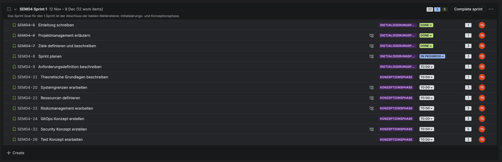
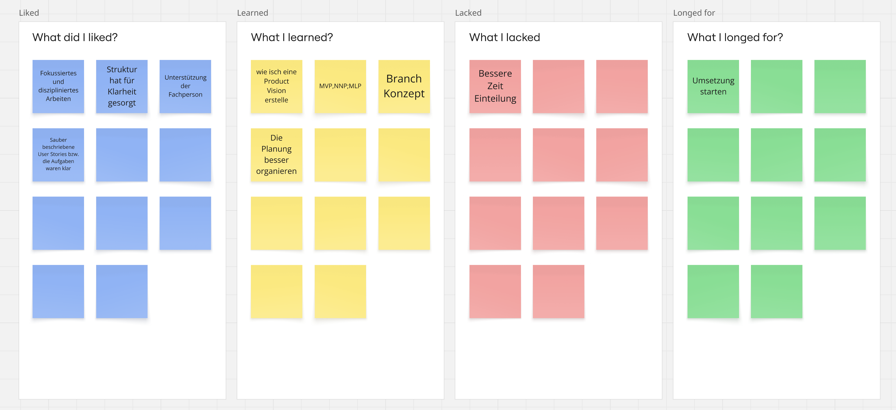
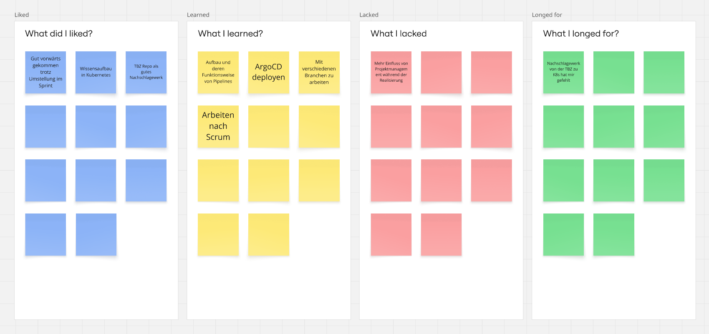
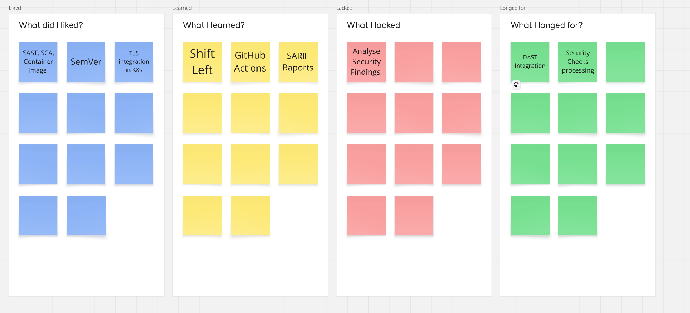
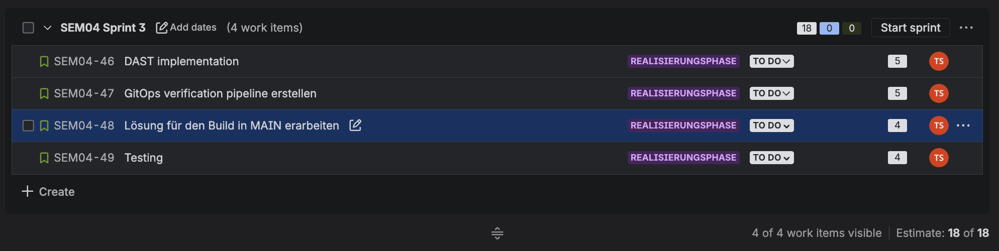
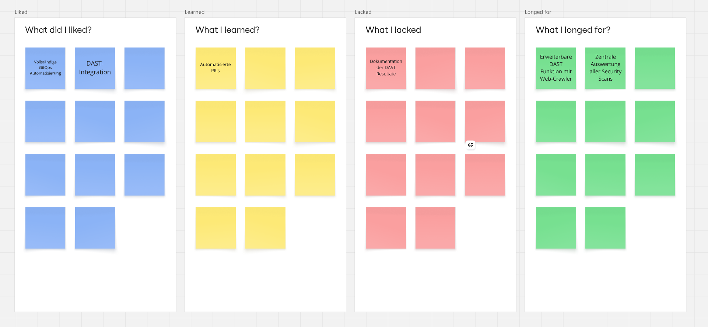

# Projektinitialisierung vom 12.11 - 08.12

| Story                               | Akzeptanzkriterium                    | Points |
| :---------------------------------- | :------------------------------------ | :----- |
| Einfürhung schreiben                | [SEM04-5](https://shorturl.at/voJ7B)  | 1      |
| Projektmanagement erläutern         | [SEM04-6](https://shorturl.at/nkYM0)  | 1      |
| Ziele definieren und beschreiben    | [SEM04-7](https://shorturl.at/MJHTs)  | 3      |
| Sprint planen                       | [SEM04-8](https://shorturl.at/CMeLD)  | 3      |
| Anforderungsdefinition beschreiben  | [SEM04-9](https://shorturl.at/fGoiQ)  | 1      |
| Theoretische Grundlagen beschreiben | [SEM04-21](https://shorturl.at/SZBGA) | 1      |
| Systemgrenzen erarbeiten            | [SEM04-20](https://shorturl.at/8NmMf) | 3      |
| Ressourcen definieren               | [SEM04-22](https://shorturl.at/5Ye3s) | 1      |
| Risikomanagement erarbeiten         | [SEM04-23](https://rb.gy/humncv)      | 3      |
| GitOps Konzept erstellen            | [SEM04-24](https://h7.cl/1kg3v)       | 3      |
| Security Konzept erstellen          | [SEM04-32](https://h7.cl/1fpry)       | 5      |
| Test Konzept erarbeiten             | [SEM04-26](https://h7.cl/1kg3M)       | 3      |

**Sprint Goal**: Abschluss und Erreichung der beiden Meilensteine; Initialisierungs- und Konzeptionsphase.

# Sprint Review

1. **Zielerreichung**  
   a. Wurde das Sprint-Ziel erreicht?  
   Das Sprint Ziel wurde nicht vollständig erreicht. Leider konnte das Konzept noch nicht ganz fertiggestellt werden.

   b. Welche User Stories wurden vollständig umgesetzt?  
   Alle User-Stories bis auf das Securtiy- und Test Konzept.
2. **Produktinkrement**  
   a. Was wurde im Sprint konkret geliefert?  
   Die Initialisierung des Projekts konnte erfolgreich abgeschlossen werden. Zudem wurde ein grosser Teil der Konzeptionsphase umgesetzt. Das für die Realisierungsphase notwendige Architekturdiagramm wurde erstellt und liegt in einer finalen Version vor.

   b. Welche Funktionalitäten sind produktiv nutzbar?  
   Da es sich bei diesem Sprint primär um einen Dokumentations- und Konzeptionssprint handelt, sind noch keine produktiv nutzbaren Funktionalitäten vorhanden.
3. **Abweichungen & offene Punkte**  
   a. Welche geplanten Inhalte konnten nicht umgesetzt werden?  
   Zum einen konnte die User Story "Security Konzept" und "Test Konzept erarbeiten" nicht abgeschlossen werden.

   b. Warum wurden diese Inhalte nicht abgeschlossen?  
   Aus zeitlichen Gründen konnte ich die Stories nicht vollständig abschliessen. Es war zu viel im 1. Sprint eingeplant worden.

   c. Müssen Stories in den nächsten Sprint übernommen werden?  
   Es gitb einen Spill over von zwei Stories. 

# Sprint Retrospektive

Für die Sprint Retrospektive wird hier eine 4L-Feedback-Technik angewendet. Dabei werden abgeschlossene Sprints rückblickend beleuchtet, um züküftige Projekte und Sprints zu verbessern.

Die 4L-Feedback-Technik strukturiert die Sprint Retrospektive anhand von vier Leitfragen: Liked beschreibt, was im Sprint gut funktioniert hat, Learned fasst neue Erkenntnisse und Lernerfahrungen zusammen, Lacked identifiziert fehlende Aspekte oder Hindernisse, und Longed for benennt Verbesserungen oder Wünsche für zukünftige Sprints. Diese Methode unterstützt eine gezielte und konstruktive Reflexion des Arbeitsprozesses.

## Liked

- Das Fokussierte und disziplinierte Arbeiten während dem Sprint hat mir persönlich am besten gefallen.
- Dank des strukturierten Projektaufbaus konnte ich den Arbeitsfortschritt besser überblicken und priorisieren.
- Mit Patrick konnte ich bereits meine Draft Version des Architekturdiagramms besprechen.
- Mir hat die saubere und klar formullierte Arbeitsaufteilung sehr gut geholfen, die Arbeit gezielt anzugehen.

## Leared

- Ich habe gelert, wie ich eine Product Vision erstelle und was die Merkmale davon sind.
- Ausserdem habe ich gelernt wie ich MMP, MLP, MVP in einem Projekt einsezte und welche Bedeutung das hat.
- Ich konnte mir gedankten zu einem Brach/Merge Konzept machen, welches ich mir zuvor nie gemacht habe.
- Ich habe durch die vielen Arbeitspackete gemerkt, wie gross der Aufwand ist und weiss nun in etwa ich es in Zukunft einteilen soll.

## Lacked

- Ich muss mein Zeitmanagement besser unter Kontrolle bekommen.

## Longed for

- Ich wünsche mir bereits mit der Realisierung starten zu können.

---

# 1. Sprint vom 09.12 - 22.12

| Story                             | Akzeptanzkriterium                       | Points |
| :-------------------------------- | :--------------------------------------- | :----- |
| Security Konzept erstellen        | [SEM04-32](https://shorturl.at/EOXJX)    | 5      |
| Git-Repository Struktur ausfetzen | [SEM04-34](https://shorturl.at/7ThLE)    | 1      |
| Ci-Pipeline Grundgerüst erstellen | [SEM04-35](https://shorturl.at/kyv76)    | 2      |
| DVPWA Docker Image vorbereiten    | [SEM04-36](https://shorturl.at/voJ7B)    | 2      |
| GitOps-Repo initialisieren        | [SEM04-37](https://shorturl.at/85Fhm)    | 2      |
| Minikube & ArgoCD aufsetzen       | [SEM04-38](https://tinyurl.com/ymcarjx8) | 2      |

**Sprint Goal**: Am Ende des Sprints steht die Grund-Infrastruktur der Projektarbeit und das Grundgerüst der Security Pipeline.

# Sprint Review

1. **Zielerreichung**  
   a. Wurde das Sprint-Ziel erreicht?  
   Das Sprint Ziel wurde erreicht. Alle Stories konnten, wie geplant erledigt werden.

   b. Welche User Stories wurden vollständig umgesetzt?  
   Alle User-Stories wurden erledigt. Es sind keine neuen Aufgaben hinzugekommen.

2. **Produktinkrement**  
   a. Was wurde im Sprint konkret geliefert?  
   In diesem Sprint wurde das Grundgerüst für die Projektarbeit aufgebaut. Das beinhaltet die Initialisierung der Repositories und das VM Setup für den Kubernetes Cluster. Ausserdem konnte bereits mit der CI Pipeline gestartet werden.

   b. Welche Funktionalitäten sind produktiv nutzbar?  
   Momentan steht der K8s Cluster mit dem ArgoCD Service. Das Main Repo ist im ArgoCD hinterlegt und wird aktiv gesynct.

3. **Abweichungen & offene Punkte**  
   a. Welche geplanten Inhalte konnten nicht umgesetzt werden?  
   Keine

   b. Warum wurden diese Inhalte nicht abgeschlossen?  
   Keine
   
   c. Müssen Stories in den nächsten Sprint übernommen werden?  
   Es werden keine Stories übernommen. 

# Sprint Retrospektive

## Liked

- In diesem Sprint bin ich sehr gut vorwärts gekommen, obwohl ich aus Projektmanagement Sicht einiges anpassen musste. Die komplette Projektinitialisierungsphase wurde als Vorarbeit abgehandelt, anstatt wie vorgesehen im Sprint 1.
- Ich konnte zum Thema K8s sehr viel neues dazulernen. Da hat mir insbesondere KodeKloud und die offizielle Dokumentation von Kubernetes gut weitergeholfen.
- Zum Thema DevSecOps wusste ich bis anhin auch nicht viel, doch das TBZ Repo von Patrick Morgenegg war für mich eine solide Stütze, um mich mit dem Thema familier zu machen.

## Leared

- Ich habe gelert, wie ich eine CI-Pipeline aufbaue und welche Kernfunktionen ich nutzen soll.
- Das Aufsezten von ArgoCD habe ich zuvor auch noch nie gemacht. Ich habe es bisher nur aus der Theorie gekannt.
- Auch habe ich nie gross mit Multi-Branches gearbeitet. Es ist beeindruckend zu sehen, wie sich die effizienz steigert, wenn man mit mehreren Branches arbeitet.
- Nach der Sprint Umstellung habe ich auch ein besseres Gefühl zum Thema Srum bekommen und weiss nun, wie ich meine Arbeitsmethodik in Zusammenhang mit Scrum zukünftig einsezten werde.

## Lacked

- Ich hatte zum Teil das Gefühl das Projektmanagement aussen vor zu lassen, während ich an der Realisierung dran war. Trotzdem habe ich mir stets Zeit eingeplant, um meine Stories zu überprüfen.

## Longed for

- Was ich mir wünschen würde, wäre eine saubere Dokumentation zum Thema Kubernetes, sowie es bei DevSecOps der Fall war.

---

# 2. Sprint vom 23.12 - 05.01

| Story                               | Akzeptanzkriterium                       | Points |
| :---------------------------------- | :--------------------------------------- | :----- |
| Lint-Checker implementieren         | [SEM04-41](https://tinyurl.com/3sj8kkrh) | 2      |
| TLS-Zerti implementieren            | [SEM04-42](https://tinyurl.com/4a5js6ad) | 4      |
| Snyk scan SAST & SCA implementieren | [SEM04-43](https://tinyurl.com/fhrusvu9) | 5      |
| Trivy Scan mit SARIF umsetzen       | [SEM04-44](https://tinyurl.com/5ecnyus4) | 4      |
| SemVersioning Logik umsetzen        | [SEM04-45](https://tinyurl.com/3zb3xunf) | 4      |

**Sprint Goal**: Am Ende des Sprints wird die Anwendung automatisiert als sicheres Container-Image gebaut und versioniert.

# Sprint Review

1. **Zielerreichung**  
   a. Wurde das Sprint-Ziel erreicht?  
   Am Ende des Sprints wurde das Ziel erreicht. Dev wie auch von Main Branch, bekomme ich ein entsprechendes Container-Image mit dem korrekten Tag.  

   b. Welche User Stories wurden vollständig umgesetzt?  
   Alle Stories wurden erfolgreich umgesetzt.

2. **Produktinkrement**  
   a. Was wurde im Sprint konkret geliefert?  
   In diesem Sprint wurden die Sicherheitstests zu der Pipeline integriert und der Kubernetes Cluster wurde um ein Ingress mit TLS Zertifikat erweitert.

   b. Welche Funktionalitäten sind produktiv nutzbar?  
   Sicherheits-Checks werden ausgegeben und können im detail analysiert werden.

3. **Abweichungen & offene Punkte**  
   a. Welche geplanten Inhalte konnten nicht umgesetzt werden?  
   Keine

   b. Warum wurden diese Inhalte nicht abgeschlossen?  
   Keine
   
   c. Müssen Stories in den nächsten Sprint übernommen werden?  
   Es werden keine Stories übernommen. 

# Sprint Retrospektive

## Liked

- Die Integration von SAST-, SCA- und Container-Scans verlief stabil und ohne grössere technische Probleme. 
- Die SemVer-Logik funktioniert zuverlässig für Dev und Main-Branch und sorgt für entsprechnde Image-Tags.
- Die Erweiterung des Kubernetes-Clusters um Ingress mit TLS konnte erfolgreich umgesetzt werden.

## Leared

- Sicherheitsprüfungen müssen früh in der Pipeline integriert werden, um spätere Fehler und Mehraufwand zu vermeiden. (Shift Left)
- GitHub Actions bietet ausreichend Flexibilität, erfordert aber saubere Bedingungen, um unerwünschte Pipeline-Läufe zu vermeiden. Zum Beispeil mit der Commit-Technik: git commit -m "string" [skip ci]
- SARIF-Reports erleichtern die strukturierte Auswertung von Security-Scans erheblich.

## Lacked

- Auf die Security Findings spezifischer eingehen

## Longed for

- Integration von DAST (OWASP ZAP) zur Laufzeitsicherheitsprüfung.
- Besseres Aufbereiten der Security Checks/Findings 

---

# 3. Sprint vom 06.12 - 23.01

| Story                                   | Akzeptanzkriterium                       | Points |
| :-------------------------------------- | :--------------------------------------- | :----- |
| DAST implementation                     | [SEM04-46](https://tinyurl.com/546453wc) | 5      |
| GitOps verification pipeline erstellen  | [SEM04-47](https://tinyurl.com/2s35nxkw) | 5      |
| Lösung für den Build in MAIN erarbeiten | [SEM04-48](https://tinyurl.com/9ucwy3jz) | 4      |
| Testing                                 | [SEM04-49](https://tinyurl.com/yzjhwayj) | 4      |

**Sprint Goal**: Am Ende des Sprints ist die Anwendung vollständig GitOps-basiert in Kubernetes deployt und zur Laufzeit testbar.

# Sprint Review

1. **Zielerreichung**  
   a. Wurde das Sprint-Ziel erreicht?  
   Am Ende des Sprints wurde das Ziel erreicht. Die Image Version wird automatisch nach einem Merge von dev in main überprüft und durch ein Pull Request zum updaten des K8s Clusters ergäntzt.  

   b. Welche User Stories wurden vollständig umgesetzt?  
   Alle Stories wurden erfolgreich umgesetzt.

2. **Produktinkrement**  
   a. Was wurde im Sprint konkret geliefert?  
   In diesem Sprint wurde die DAST-Integration hinzugefügt und eine weitere Pipeline, welche das aktuelle Image überprüft und durch ein PR den K8s Cluster aktuell hält.

   b. Welche Funktionalitäten sind produktiv nutzbar?  
   Von nun an können die Entwicker an ihrem Code arbeiten und gleichzeitig werden sie über Sicherheitsschwachstellen informiert. Das Deployment auf eine produktive Umgebung ist ganz einfach automatisiert, sodass es nur noch über einen PR apporved werden muss.

3. **Abweichungen & offene Punkte**  
   a. Welche geplanten Inhalte konnten nicht umgesetzt werden?  
   Keine

   b. Warum wurden diese Inhalte nicht abgeschlossen?  
   Keine
   
   c. Müssen Stories in den nächsten Sprint übernommen werden?  
   Es werden keine Stories übernommen. 

# Sprint Retrospektive

## Liked

- Die vollständige GitOps-Automatisierung konnte erfolgreich umgesetzt werden, inklusive Pull-Request-basierter Aktualisierung des Kubernetes-Deployments.
- Die DAST-Integration lieferte aussagekräftige Ergebnisse und ergänzte die bestehenden statischen Sicherheitsprüfungen sinnvoll.

## Leared

- Automatisierte PRs sind ein effektiver Weg, um Kontrolle und Nachvollziehbarkeit trotz hoher Automatisierung sicherzustellen.

## Lacked

- Dokumentation der DAST-Ergebnisse direkt im GitHub-Security-Kontext (Issues/Annotations).

## Longed for

- Erweiterte DAST-Profile mit Authentifizierung und tieferem Crawl-Verhalten.
- Zentrale Auswertung aller Security-Scans in einem Dashboard.